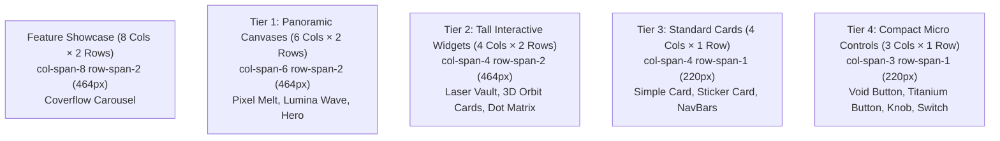

# Technical Research: `/gallery` Grid Architecture, Alignment & Spanning Mechanics

> **Target URL**: `http://localhost:3000/gallery`  
> **Topic**: Responsive 12-Column Grid System, Dense Bento Packing (`grid-flow-dense`), `auto-rows-[220px]`, `col-span` / `row-span` Mechanics, and Component Layout Archetypes.

---

## 1. Executive Summary & Layout Philosophy

The `/gallery` endpoint in `void/ui` serves as the central visual exhibition for 62 custom React components. Previously, the gallery relied on an identical, rigid grid where every card was constrained to a fixed 280px tall skeuomorphic box with an inner recessed screen well and descriptive paragraph text. This created visual clutter, while wide atmospheric backgrounds (*Pixel Melt*, *Spotlight Grid*) and 3D showcases (*Coverflow Carousel*) were clipped or invisible, and smaller buttons were surrounded by excessive empty padding.

### The "Scattered Exhibition" Design
To solve this, the gallery operates on an asymmetric, rhythmic **Bento Grid Architecture** inspired by modern industrial UI showcases:
1. **Differentiated Component Archetypes**:
   - **Ambient Canvases**: Run edge-to-edge across the tile with zero intro pills, zero description paragraphs, and a discreet floating title badge in **Poppins** font.
   - **Interactive Components**: Occupy the full card div directly at natural scale, eliminating miniature `1280x720` desktop mockup shrink-down boxes.
2. **True 2D Bento Spanning (`col-span` + `row-span`)**:
   - Cards take varied horizontal spans (`col-span-8`, `col-span-6`, `col-span-4`, `col-span-3`) and vertical heights (`row-span-2` = 464px, `row-span-1` = 220px).
   - Expansive canvases and carousels stretch wide and tall, while tactile buttons and micro-controls stay compact and modular.
3. **Dense Hole-Free Auto-Packing (`grid-flow-dense`)**:
   - CSS Grid's dense packing algorithm automatically pulls compact items forward to backfill vacant column slots, completely eliminating empty holes on the left and right margins of the viewport.

---

## 2. Responsive 12-Column Grid Architecture

The gallery layout uses a responsive CSS Grid system configured in `apps/docs/src/app/gallery/page.tsx`:

```tsx
<div className="grid grid-cols-1 sm:grid-cols-6 lg:grid-cols-12 auto-rows-[220px] grid-flow-dense gap-6">
  {visible.map((item, i) => (
    <GalleryCard key={item.slug} item={item} index={i} accent={CATEGORY_ACCENT[item.category]} />
  ))}
</div>
```

### Breakpoint Breakdown

| Viewport | Tailwind Breakpoint | Grid Columns | Track Sizing | Card Behavior |
| :--- | :--- | :--- | :--- | :--- |
| **Mobile** | `< 640px` (Default) | `grid-cols-1` | `1fr` | All cards take full screen width (`col-span-12` behaves as 100%). |
| **Tablet** | `sm:` (`640px` – `1023px`) | `grid-cols-6` | `repeat(6, 1fr)` | Wide cards take full row (`sm:col-span-6`); standard and compact cards take half row (`sm:col-span-3`). |
| **Desktop** | `lg:` (`>= 1024px`) | `grid-cols-12` | `repeat(12, 1fr)` | Full modular flexibility: cards span 8, 6, 4, or 3 columns across 1 or 2 row tracks. |

### Column Partitioning Diagram (Desktop: 12 Columns)

```
┌──────────────────────────────────────────────────────────────────────────┐
│                             12 COLUMN GRID TRACK                         │
├───────────────────────────────────────────────────┬──────────────────────┤
│  FEATURE SHOWCASE: Coverflow Carousel (8 COLS)   │  STANDARD (4 COLS)   │
│  col-span-8 row-span-2 (464px tall)               │  col-span-4          │
├────────────────────────────────────┬──────────────┴──────────────────────┤
│  WIDE SHOWCASE / CANVAS (6 COLS)   │   WIDE SHOWCASE / CANVAS (6 COLS)   │
│  col-span-6 row-span-2 (464px tall)│   col-span-6 row-span-2 (464px tall)│
├──────────────────┬─────────────────┴──┬──────────────────────────────────┤
│  STANDARD (4)    │   STANDARD (4)     │   STANDARD (4)                   │
│  col-span-4      │   col-span-4       │   col-span-4                     │
├──────────────┬───┴──────────┬─────────┴────┬─────────────────────────────┤
│  COMPACT (3) │  COMPACT (3) │  COMPACT (3) │  COMPACT (3)                │
│  col-span-3  │  col-span-3  │  col-span-3  │  col-span-3 (220px tall)    │
└──────────────┴──────────────┴──────────────┴─────────────────────────────┘
```

---

## 3. Column Span (`col-span`) & Row Span (`row-span`) Tier System

The gallery classifies every component into distinct span tiers via `getCardSpan(slug, category)`:

```tsx
function getCardSpan(slug: string, category: ComponentCategory) {
  // Feature Showcase: Coverflow Carousel (Wide 8-col stage + 2-row height = 464px)
  if (slug === "coverflow-carousel") {
    return "col-span-12 sm:col-span-6 lg:col-span-8 row-span-2";
  }

  // Large Panoramic Canvases & Big Showcases (6-col width + 2-row height = 464px)
  if (
    slug === "pixel-melt" ||
    slug === "spotlight-grid" ||
    slug === "floating-embers" ||
    slug === "lumina-wave" ||
    slug === "matrix-rain" ||
    slug === "breathing-grid" ||
    slug === "infinite-scroll" ||
    slug === "image-parallax" ||
    slug === "living-text" ||
    slug === "bento-grid" ||
    slug === "globe" ||
    slug === "hero" ||
    slug === "premium-hero" ||
    slug === "timeline"
  ) {
    return "col-span-12 sm:col-span-6 lg:col-span-6 row-span-2";
  }

  // Standard 2-row Interactive Cards & Widgets (4-col width + 2-row height = 464px)
  if (
    slug === "laser-vault-password" ||
    slug === "cards-two" ||
    slug === "dot-matrix" ||
    slug === "github-heatmap"
  ) {
    return "col-span-12 sm:col-span-6 lg:col-span-4 row-span-2";
  }

  // Compact: Buttons & modular micro-controls (3-col width + 1-row height = 220px)
  if (
    category === "buttons" ||
    slug === "anisotropic-knob" ||
    slug === "switch" ||
    slug === "stepper" ||
    slug === "otp-input" ||
    slug === "tooltip" ||
    slug === "animated-icons-1" ||
    slug === "scroll-progress"
  ) {
    return "col-span-12 sm:col-span-3 lg:col-span-3 row-span-1";
  }

  // Standard 1-row items (4-col width + 1-row height = 220px)
  return "col-span-12 sm:col-span-6 lg:col-span-4 row-span-1";
}
```

### Span Tier Specifications



1. **Feature Showcase (`col-span-8 row-span-2`, 66.6% width, 464px height)**:
   - **Rationale**: `CoverflowCarousel` features an internal 3D stage of $400\text{px}$ height with cards measuring $260 \times 340\text{px}$ rotated in 3D space across a horizontal spread of $\pm 480\text{px}$. Allocating 8 columns and 2 rows ensures full visibility of the active card and both lateral angled cards without clipping.
2. **Panoramic Canvases & Big Showcases (`col-span-6 row-span-2`, 50% width, 464px height)**:
   - **Rationale**: Atmospheric background simulations (*Pixel Melt*, *Spotlight Grid*, *Lumina Wave*) require substantial area to demonstrate particle flow, fluid turbulence, and cursor disturbance.
3. **Tall Widgets (`col-span-4 row-span-2`, 33.3% width, 464px height)**:
   - **Rationale**: High-density interactive widgets with vertical details (*Laser Vault*, *Dot Matrix*, *GitHub Heatmap*) require vertical clearance to show all dials and rows without cramming.
4. **Compact Buttons & Micro Controls (`col-span-3 row-span-1`, 25% width, 220px height)**:
   - **Rationale**: Discrete hardware-inspired buttons (*Void Button*, *Brushed Titanium Button*, *Liquid Gold Button*) and controls (*Anisotropic Knob*, *Switch*, *Stepper*) look best in tighter modular units.

---

## 4. Row Span (`row-span`) & Dense Auto-Flow Mechanics

### Height Math & Gap Alignment
In CSS Grid, child items spanning across multiple rows must compensate for the grid gap between rows. The formula for row span heights is:

$$\text{Card Height} = (N \times \text{Base Row Unit}) + ((N - 1) \times \text{Gap})$$

With the production configuration:
- **Base Row Unit**: `auto-rows-[220px]`
- **Grid Gap**: `gap-6` = `1.5rem` = `24px`

| Row Span | Mathematical Formula | Calculated Height | Implemented Grid Behavior |
| :--- | :--- | :--- | :--- |
| **`row-span-1`** | $1 \times 220\text{px} + (0 \times 24\text{px})$ | **`220px`** | Compact micro-controls, buttons, standard single cards |
| **`row-span-2`** | $2 \times 220\text{px} + (1 \times 24\text{px})$ | **`464px`** | Coverflow carousel, large canvases, tall interactive widgets |

> **Alignment Precision**: Two vertically stacked 1-row cards ($220\text{px} + 24\text{px} + 220\text{px} = 464\text{px}$) exactly equal the height of a neighboring 2-row card down to the exact pixel.

### The Role of `grid-auto-flow: dense`
In asymmetric grid layouts, placing a wide item (`col-span-8` or `col-span-6`) after a medium item (`col-span-4`) would normally leave an unfilled gap of 2 to 4 columns if the wide item is forced onto the next row.

By applying **`grid-flow-dense`** (`grid-auto-flow: dense` in CSS):
- The browser's grid layout engine continuously searches forward in the DOM for smaller cards (`col-span-4` or `col-span-3`).
- When an empty column slot is detected on the left or right, it immediately pulls forward subsequent matching items to backfill the vacancy.
- **Result**: Zero awkward orphan gaps or empty margin holes across the entire gallery.

---

## 5. Coverflow Carousel Visibility Fix

### Root Cause Analysis
Previously, `CoverflowCarousel` was not rendering properly on `/gallery`:
1. **Container Height Squeeze**: The card container was restricted to a single row unit (~260px max). The carousel component renders 3D cards of $260 \times 340\text{px}$ inside a container with `overflow-hidden`. As a result, the cards were vertically clipped and rendered invisible.
2. **Embed Stage Missing**: The `/embed/coverflow-carousel` route had no tailored stage dimensions for gallery mode, defaulting to a tight container where cards exceeded boundaries.

### Solution Implemented
1. **Dedicated Embed Stage (`apps/docs/src/app/embed/[slug]/page.tsx`)**:
   ```tsx
   if (isGallery && slug === "coverflow-carousel") {
     return (
       <div className="w-screen h-screen bg-[#070707] text-white overflow-hidden relative select-none flex items-center justify-center">
         <div className="w-[860px] h-[480px] shrink-0 transform scale-[0.78] sm:scale-[0.88] lg:scale-[0.92] origin-center flex items-center justify-center overflow-hidden pointer-events-none select-none">
           <PresentationRenderer entry={entry} liveProps={liveProps} hideIntro={hideIntro} mode="gallery" />
         </div>
       </div>
     );
   }
   ```
2. **Allocated 8-Column × 2-Row Footprint (`page.tsx`)**:
   - Spans `col-span-12 sm:col-span-6 lg:col-span-8 row-span-2` ($464\text{px}$ tall by $66.6\%$ wide).
   - This provides abundant horizontal clearance for the 3D rotating cards and vertical clearance for the 340px tall preview image cards.

---

## 6. Card Internal Alignment & Flex Hierarchy

To guarantee that cards of different sizes look unified when placed side-by-side, each card uses a strict flex layout hierarchy:

```
┌─────────────────────────────────────────────────────────────┐
│  Outer Card: skeuo-bevel-card rounded-2xl h-full flex-col    │
│  (Hover: Category accent radial glow + subtle lift)         │
├─────────────────────────────────────────────────────────────┤
│                                                             │
│  PREVIEW VIEWPORT (flex-1 flex items-center justify-center) │
│  • Ambient Canvas: Edge-to-Edge full bleed iframe           │
│  • Interactive Component: Centered responsive component     │
│                                                             │
├─────────────────────────────────────────────────────────────┤
│  INFO STRIP / BADGE (Poppins font, no preceding dots)       │
│  • Ambient: Floating glassmorphic tag with CANVAS pill      │
│  • Interactive: Border-t bar with title & arrow icon        │
│  └──────────────────────────────────────────────────────────┘
```

### A. Ambient Canvas Card Structure
```tsx
<div className="relative w-full h-full flex-1 overflow-hidden">
  {/* Full-bleed live background iframe (100% width and height) */}
  <GalleryIframePreview slug={item.slug} title={item.name} mode="gallery" className="w-full h-full" />

  {/* Minimalist floating title overlay anchored bottom-left */}
  <div className="absolute bottom-3.5 left-3.5 z-20 pointer-events-none flex items-center gap-2">
    <div className="px-3.5 py-1.5 rounded-lg bg-black/70 backdrop-blur-md border border-white/10 shadow-[0_4px_12px_rgba(0,0,0,0.6)] flex items-center gap-2">
      <span className="font-poppins text-[13px] font-medium text-white/95 tracking-wide" style={{ fontFamily: "'Poppins', sans-serif" }}>
        {item.name}
      </span>
      <span className="font-mono text-[9px] text-white/40 uppercase tracking-widest pl-1 border-l border-white/10">
        CANVAS
      </span>
    </div>
  </div>
</div>
```

### B. Interactive Component Card Structure
```tsx
<div className="relative w-full h-full flex-1 flex flex-col justify-between">
  {/* Full-div component display area */}
  <div className="relative w-full flex-1 flex items-center justify-center overflow-hidden">
    <GalleryIframePreview slug={item.slug} title={item.name} mode="gallery" />
  </div>

  {/* Refined bottom title bar */}
  <div className="border-t border-white/[0.05] px-4 py-2.5 bg-black/40 backdrop-blur-xs flex items-center justify-between z-20">
    <h3 className="font-poppins text-[13px] font-medium text-white/90 tracking-wide" style={{ fontFamily: "'Poppins', sans-serif" }}>
      {item.name}
    </h3>
    <span className="material-symbols-outlined text-[13px] text-white/25 group-hover:text-white/80 group-hover:translate-x-0.5 transition-all">
      arrow_forward
    </span>
  </div>
</div>
```

---

## 7. Complete 62-Component Grid Classification Matrix

Below is the definitive reference table showing how each component in the registry is mapped into the grid:

| # | Component Name | Slug | Category | Column Span | Row Span | Height | Card Type |
| :---: | :--- | :--- | :--- | :---: | :---: | :---: | :--- |
| 1 | **Pixel Melt** | `pixel-melt` | `backgrounds` | `col-span-6` | `row-span-2` | `464px` | Ambient Canvas |
| 2 | **Breathing Grid** | `breathing-grid` | `backgrounds` | `col-span-6` | `row-span-2` | `464px` | Ambient Canvas |
| 3 | **Floating Embers** | `floating-embers` | `backgrounds` | `col-span-6` | `row-span-2` | `464px` | Ambient Canvas |
| 4 | **Spotlight Grid** | `spotlight-grid` | `backgrounds` | `col-span-6` | `row-span-2` | `464px` | Ambient Canvas |
| 5 | **Lumina Wave** | `lumina-wave` | `backgrounds` | `col-span-6` | `row-span-2` | `464px` | Ambient Canvas |
| 6 | **Matrix Rain** | `matrix-rain` | `backgrounds` | `col-span-6` | `row-span-2` | `464px` | Ambient Canvas |
| 7 | **Breathing Background** | `breathing-background` | `backgrounds` | `col-span-4` | `row-span-1` | `220px` | Ambient Canvas |
| 8 | **Dot Pattern Playground** | `dot-pattern-playground` | `animated` | `col-span-4` | `row-span-1` | `220px` | Ambient Canvas |
| 9 | **Flickering Grid Playground**| `flickering-grid-playground`| `animated`| `col-span-4` | `row-span-1` | `220px` | Ambient Canvas |
| 10 | **Coverflow Carousel** | `coverflow-carousel` | `animated` | `col-span-8` | `row-span-2` | `464px` | Feature 3D Showcase |
| 11 | **Living Text** | `living-text` | `animated` | `col-span-6` | `row-span-2` | `464px` | Panoramic Showcase |
| 12 | **Image Parallax** | `image-parallax` | `animated` | `col-span-6` | `row-span-2` | `464px` | Panoramic Showcase |
| 13 | **Infinite Scroll** | `infinite-scroll` | `animated` | `col-span-6` | `row-span-2` | `464px` | Panoramic Showcase |
| 14 | **Bento Grid** | `bento-grid` | `animated` | `col-span-6` | `row-span-2` | `464px` | Panoramic Showcase |
| 15 | **Globe** | `globe` | `animated` | `col-span-6` | `row-span-2` | `464px` | Panoramic Showcase |
| 16 | **Hero Landing** | `hero` | `animated` | `col-span-6` | `row-span-2` | `464px` | Panoramic Landing |
| 17 | **Premium Hero** | `premium-hero` | `animated` | `col-span-6` | `row-span-2` | `464px` | Panoramic Landing |
| 18 | **Timeline** | `timeline` | `animated` | `col-span-6` | `row-span-2` | `464px` | Panoramic Showcase |
| 19 | **Void Button** | `void-button` | `buttons` | `col-span-3` | `row-span-1` | `220px` | Tactile Button |
| 20 | **Brushed Titanium Button** | `brushed-titanium-button` | `buttons` | `col-span-3` | `row-span-1` | `220px` | Tactile Button |
| 21 | **Liquid Gold Button** | `liquid-gold-button` | `buttons` | `col-span-3` | `row-span-1` | `220px` | Tactile Button |
| 22 | **Guilloche Button** | `guilloche-button` | `buttons` | `col-span-3` | `row-span-1` | `220px` | Tactile Button |
| 23 | **Button Alpha** | `button-alpha` | `buttons` | `col-span-3` | `row-span-1` | `220px` | Tactile Button |
| 24 | **Anisotropic Knob** | `anisotropic-knob` | `primitives` | `col-span-3` | `row-span-1` | `220px` | Micro Control |
| 25 | **Switch** | `switch` | `animated` | `col-span-3` | `row-span-1` | `220px` | Micro Control |
| 26 | **Stepper** | `stepper` | `animated` | `col-span-3` | `row-span-1` | `220px` | Micro Control |
| 27 | **OTP Component** | `otp-input` | `animated` | `col-span-3` | `row-span-1` | `220px` | Micro Control |
| 28 | **Tooltip** | `tooltip` | `animated` | `col-span-3` | `row-span-1` | `220px` | Micro Control |
| 29 | **Animated Icons 1** | `animated-icons-1` | `animated` | `col-span-3` | `row-span-1` | `220px` | Micro Control |
| 30 | **Scroll Progress** | `scroll-progress` | `animated` | `col-span-3` | `row-span-1` | `220px` | Micro Control |
| 31 | **Cards Two (3D Orbit)** | `cards-two` | `animated` | `col-span-4` | `row-span-2` | `464px` | Tall Interactive Card |
| 32 | **Vault** | `laser-vault-password` | `widgets` | `col-span-4` | `row-span-2` | `464px` | Tall Interactive Widget |
| 33 | **Dot Matrix** | `dot-matrix` | `animated` | `col-span-4` | `row-span-2` | `464px` | Tall Interactive Widget |
| 34 | **GitHub Heatmap** | `github-heatmap` | `animated` | `col-span-4` | `row-span-2` | `464px` | Tall Interactive Widget |
| 35 | **Cards** | `cards` | `animated` | `col-span-4` | `row-span-1` | `220px` | Interactive Card |
| 36 | **Simple Card** | `simple-card` | `animated` | `col-span-4` | `row-span-1` | `220px` | Interactive Card |
| 37 | **Sticker Card** | `sticker-card` | `animated` | `col-span-4` | `row-span-1` | `220px` | Interactive Card |
| 38 | **Breathing Scale Card** | `breathing-scale-card` | `animated` | `col-span-4` | `row-span-1` | `220px` | Interactive Card |
| 39 | **Dashed Feature Card** | `dashed-feature-card` | `animated` | `col-span-4` | `row-span-1` | `220px` | Interactive Card |
| 40 | **Dashed Marquee** | `dashed-marquee` | `animated` | `col-span-4` | `row-span-1` | `220px` | Interactive Card |
| 41 | **Marquee 2** | `marquee-2` | `animated` | `col-span-4` | `row-span-1` | `220px` | Interactive Card |
| 42 | **Now Playing Card** | `now-playing-card` | `animated` | `col-span-4` | `row-span-1` | `220px` | Interactive Widget |
| 43 | **Datepicker** | `datepicker` | `animated` | `col-span-4` | `row-span-1` | `220px` | Interactive Widget |
| 44 | **Developer ID Card** | `developer-id-card` | `animated` | `col-span-4` | `row-span-1` | `220px` | Interactive Widget |
| 45 | **Meter** | `meter` | `animated` | `col-span-4` | `row-span-1` | `220px` | Interactive Widget |
| 46 | **Expand On Hover** | `expand-on-hover` | `animated` | `col-span-4` | `row-span-1` | `220px` | Interactive Widget |
| 47 | **Spotlight Text** | `spotlight-text` | `animated` | `col-span-4` | `row-span-1` | `220px` | Interactive Showcase |
| 48 | **Text Shuffle** | `text-shuffle` | `animated` | `col-span-4` | `row-span-1` | `220px` | Interactive Showcase |
| 49 | **Image Reveal** | `image-reveal` | `animated` | `col-span-4` | `row-span-1` | `220px` | Interactive Showcase |
| 50 | **Gravity Card Stack** | `gravity-card-stack` | `animated` | `col-span-4` | `row-span-1` | `220px` | Interactive Showcase |
| 51 | **Morphing Nav** | `morphing-nav` | `animated` | `col-span-4` | `row-span-1` | `220px` | Navigation |
| 52 | **NavBar1** | `navbar-1` | `animated` | `col-span-4` | `row-span-1` | `220px` | Navigation |
| 53 | **Wheel Picker** | `wheel-picker` | `animated` | `col-span-4` | `row-span-1` | `220px` | Control Primitive |
| 54 | **Weapon Wheel** | `weapon-wheel` | `animated` | `col-span-4` | `row-span-1` | `220px` | Control Primitive |
| 55 | **Accordion** | `accordion` | `animated` | `col-span-4` | `row-span-1` | `220px` | Modular Primitive |
| 56 | **Bevel Alert Dialog** | `bevel-alert-dialog` | `animated` | `col-span-4` | `row-span-1` | `220px` | Modular Primitive |
| 57 | **Sidebar** | `sidebar` | `animated` | `col-span-4` | `row-span-1` | `220px` | Navigation |
| 58 | **Command Palette** | `command-palette` | `animated` | `col-span-4` | `row-span-1` | `220px` | Navigation |
| 59 | **Scroll Path Draw** | `scroll-path-draw` | `animated` | `col-span-4` | `row-span-1` | `220px` | Showcase |
| 60 | **ForgeUI Landing** | `forgeui-landing` | `animated` | `col-span-4` | `row-span-1` | `220px` | Landing Preview |
| 62 | **Rays Landing** | `rays-landing` | `animated` | `col-span-4` | `row-span-1` | `220px` | Landing Preview |

---

## 8. Developer Cheatsheet: How to Tune or Add Spans

When adding a new component to `apps/docs/src/registry/index.ts` or modifying existing spans in `page.tsx`:

### Rule 1: Choose the Visual Archetype
- **If the component is an ambient background effect** (no central widget; canvas covers the whole area):
  1. Add slug to `isAmbientCanvas()`.
  2. Map to `col-span-6 row-span-2` in `getCardSpan()`.
  3. Ensure `/embed/[slug]` renders the canvas with `hideIntro={true}`.
- **If the component is a compact button or single dial/toggle**:
  1. Map to `col-span-3 row-span-1` in `getCardSpan()`.
- **If the component is a large 3D showcase or wide carousel**:
  1. Map to `col-span-8 row-span-2` in `getCardSpan()`.
- **If the component is a standard card or multi-step widget**:
  1. Default to `col-span-4 row-span-1` (or `row-span-2` if it requires tall vertical clearance) in `getCardSpan()`.

### Rule 2: Grid Packing Check
- With `grid-flow-dense` and `auto-rows-[220px]` enabled:
  - 1-row items measure $220\text{px}$.
  - 2-row items measure $464\text{px}$ ($220 \times 2 + 24\text{px}$).
  - Two stacked 1-row items will pack seamlessly next to a 2-row item.
  - The browser will automatically backfill any empty spaces on the left or right sides of wide cards.
