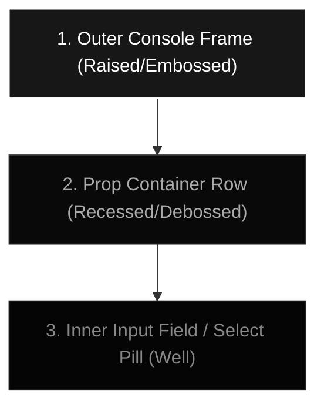

# Skeuomorphic 3D Beveled UI — Design Spec & Prompt

This specification details the styling tokens, shadows, borders, and depth parameters used to construct the tactile, **3D beveled and debossed (sunken)** physical aesthetic of the properties panel.

---

## 1. Design Concept: "Machined Enclosure"
The design mimics a physical device console crafted from dark-brushed polymer or metal, with machined cutouts where buttons and parameter controls are recessed. It balances flat aesthetics with high-contrast light reflections (highlights) and occlusion shadows (depth) to create elevation.



---

## 2. Token Specification & CSS Formulas

### A. Outer Console Frame (Embossed/Raised Layer)
*   **Aesthetic Goal**: A solid control deck lifted above the workspace with machined edges that catch overhead ambient light.
*   **Background**: `#171717` (Dark Charcoal Matte) + `backdrop-blur-2xl`.
*   **Borders**:
    *   *Top Border*: `border-t border-white/20` (`rgba(255,255,255,0.2)`) — simulating a strong overhead bevel highlight.
    *   *Side Borders*: `border-x border-white/[0.02]` (`rgba(255,255,255,0.02)`) — soft edge defining line.
    *   *Bottom Border*: `border-b border-white/10` (`rgba(255,255,255,0.1)`) — shadow transition border.
*   **Box Shadow Formula**:
    ```css
    box-shadow: 
      /* 1. Bevel Inner Top Highlight (Overhead Light Catch) */
      inset 0 1.5px 0 0 rgba(255, 255, 255, 0.08),
      
      /* 2. Bevel Inner Bottom Shadow (Physical Thickness Lip) */
      inset 0 -1.5px 0 0 rgba(0, 0, 0, 0.4),
      
      /* 3. Global Ambient Drop Shadow (High Elevation) */
      0 30px 80px rgba(0, 0, 0, 0.6);
    ```

### B. Inner Parameter Cards (Debossed/Recessed Tray)
*   **Aesthetic Goal**: Appears as a well cut out of the console frame, sinking down into the chassis.
*   **Background**: `#090909` (Obsidian Well).
*   **Borders**:
    *   `border border-white/[0.04]` (increases to `hover:border-white/[0.08]`).
*   **Box Shadow Formula**:
    ```css
    box-shadow: 
      /* 1. Deep Inner Top Shadow (Occluding light from panel depth) */
      inset 0 2px 4px rgba(0, 0, 0, 0.8),
      
      /* 2. Bevel Bottom Lip Highlight (Outer rim catching overhead light) */
      0 1px 0 rgba(255, 255, 255, 0.05);
    ```

### C. Controls & Inputs (Debossed Wells)
*   **Aesthetic Goal**: Absolute depth for interactive segments. Text inputs and unselected buttons are pressed further into the tray.
*   **Background**: `#050505` (Deep Void Black).
*   **Borders**:
    *   `border border-white/5` (transitions to `focus:border-white/20`).
*   **Box Shadow Formula**:
    ```css
    box-shadow: 
      /* 1. Inner Shadow (Sinking the input) */
      inset 0 1.5px 3px rgba(0, 0, 0, 0.6);
    ```

### D. Active Selection Pills (Raised Button Toggle)
*   **Aesthetic Goal**: A solid button pushing upward out of its slot when toggled.
*   **Background**: Solid `#FFFFFF` (White) with `#000000` text.
*   **Borders**:
    *   `border border-white/35`.
*   **Box Shadow Formula**:
    ```css
    box-shadow: 
      /* 1. Outer Button Drop Shadow (Casting shadow onto the sunken well) */
      0 2px 4px rgba(0, 0, 0, 0.2);
    ```

---

## 3. Indepth Spec Prompt for Generators / Design Systems

Copy and use this prompt to spec out components in code generators or system styling engines:

> **Design Specification: High-Friction 3D Skeuomorphic UI Panel**
>
> Create a dark-themed UI container using a skeuomorphic "machined metal/polymer chassis" layout with distinct 3D elevation levels (embossed frame and debossed wells):
>
> 1. **Chassis Frame (Raised Panel)**: Dark-neutral `#171717` solid face. Apply `border-top: 1px solid rgba(255, 255, 255, 0.20)` (top bevel light edge) and `border-bottom: 1px solid rgba(255, 255, 255, 0.10)`. Inside the chassis border, apply `box-shadow: inset 0 1.5px 0 0 rgba(255, 255, 255, 0.08)` (inner highlight edge) and `inset 0 -1.5px 0 0 rgba(0, 0, 0, 0.40)` (bottom lip occlusion shadow).
> 
> 2. **Sunken Trays (Recessed Well Containers)**: Deep obsidian `#090909` background cards. Border is a thin `1px solid rgba(255, 255, 255, 0.04)`. Apply `box-shadow: inset 0 2px 4px rgba(0, 0, 0, 0.80)` (inner shadow mapping depth inside the cutout) and `0 1px 0 rgba(255, 255, 255, 0.05)` (bottom outer highlight catching light).
> 
> 3. **Input Elements (Sub-Wells)**: Solid `#050505` background. Border is `1px solid rgba(255, 255, 255, 0.05)`. Apply `box-shadow: inset 0 1.5px 3px rgba(0, 0, 0, 0.60)` to depress inputs inward.
> 
> 4. **Selected Toggles (Raised Pills)**: Clean solid white `#FFFFFF` button. Apply `border: 1px solid rgba(255, 255, 255, 0.35)` and `box-shadow: 0 2px 4px rgba(0, 0, 0, 0.20)` to elevate it above the recessed wells.


  ================================================================================                                                              
    PRODUCTION SPECIFICATION: HYPER-TACTILE MACHINED BEVEL CARD (FLAT AESTHETIC)                                                                  
    ================================================================================                                                              
                                                                                                                                                  
    1. MATERIALITY & SURFACE TEXTURE                                                                                                              
    - Core Material: Solid "machined polymer" matte surface with high light-absorption properties (non-reflective face).                          
    - Base Color: Solid dark charcoal carbon (#171717).                                                                                           
    - Corner Geometry: 16px corner radius (equivalent to Tailwind's `rounded-2xl`). Must use squircle (sub-pixel curvature smoothing) to prevent  
  corner highlight pinching.                                                                                                                      
                                                                                                                                                  
    2. LIGHT PHYSICS & MULTI-LAYERED SPECULAR HIGHLIGHTS                                                                                          
    The card uses a simulated overhead ambient light source. This requires different border treatments for each horizon:                          
                                                                                                                                                  
    A. The Horizon Top Edge (Primary Specular Light Catch):                                                                                       
    - Highlight Overlay: A razor-thin, 1px top border line using a high-contrast white light catch: border-top: 1px solid rgba(255, 255, 255, 0.  
  22).                                                                                                                                            
    - Underlay Refraction: Directly below the top border, a soft 1.5px inner white gloss lines the inside edge to simulate light scattering       
  through the bevel bevel edge: inset 0 1.5px 0 0 rgba(255, 255, 255, 0.08).                                                                      
                                                                                                                                                  
    B. The Lateral Side Edges (Soft Ambient Roll-off):                                                                                            
    - Side Borders: A sub-pixel, low-opacity defining line to separate the card from dark backgrounds without creating high-contrast lines:       
  border-left/right: 1px solid rgba(255, 255, 255, 0.02).                                                                                         
                                                                                                                                                  
    C. The Horizon Bottom Edge (Occlusion Border & Shadow Catch):                                                                                 
    - Outer Bottom Border: A subtle, darker physical border separating the base from the drop shadow: border-bottom: 1px solid rgba(255, 255, 255,
  0.1).                                                                                                                                           
    - Inner Bottom Occlusion: An inner deep shadow representing physical surface occlusion (light blocking at the bottom lip): inset 0 -1.5px 0 0 
  rgba(0, 0, 0, 0.45).                                                                                                                            
                                                                                                                                                  
    3. DUAL-FREQUENCY GLOBAL DROP SHADOWS                                                                                                         
    To simulate physical suspension above the viewport background, the drop shadow is split into high-frequency and low-frequency components:     
    - High-Frequency (Ambient Occlusion): A sharp, dark, short-range shadow hugging the bottom edge to anchor the object: 0 4px 6px -1px rgba(0, 0,
  0, 0.8), 0 2px 4px -1px rgba(0, 0, 0, 0.9).                                                                                                     
    - Low-Frequency (Soft Ambient Blur): A wide, low-opacity shadow simulating scattered light absorption under the card: 0 30px 80px rgba(0, 0, 0,
  0.65).                                                                                                                                          
                                                                                                                                                  
    4. THE RECESSED CONCENTRIC INNER SOCKET (CONTENT FRAME)                                                                                       
    Any inner item container (e.g. icon slot, button, or input frame) must follow a "sunken socket" behavior concentrically aligned inside the    
  card:                                                                                                                                           
    - Socket Background: Matte obsidian depth (#070707).                                                                                          
    - Socket Border: A 1px boundary line: border: 1px solid rgba(255, 255, 255, 0.05).                                                            
    - Socket Cavity Shadow: A deep recessed inset shadow simulating light dropping off inside the socket wall: box-shadow: inset 0 1.5px 3.5px    
  rgba(0, 0, 0, 0.85).                                                                                                                            
                                                                                                                                                  
    ================================================================================                                                              
    PRODUCTION-READY CSS SPECIFICATION                                                                                                            
    ================================================================================                                                              
    [CSS Selector]                                                                                                                                
    .skeuo-bevel-card {                                                                                                                           
      background-color: #171717;                                                                                                                  
      border-radius: 16px;                                                                                                                        
      border-top: 1px solid rgba(255, 255, 255, 0.22);                                                                                            
      border-left: 1px solid rgba(255, 255, 255, 0.02);                                                                                           
      border-right: 1px solid rgba(255, 255, 255, 0.02);                                                                                          
      border-bottom: 1px solid rgba(255, 255, 255, 0.10);                                                                                         
      box-shadow:                                                                                                                                 
        /* 1. Inner Top Specular Light Catch */                                                                                                   
        inset 0 1.5px 0 0 rgba(255, 255, 255, 0.08),                                                                                              
        /* 2. Inner Bottom Occlusion Cavity Shadow */                                                                                             
        inset 0 -1.5px 0 0 rgba(0, 0, 0, 0.45),                                                                                                   
        /* 3. High-Frequency Ambient Occlusion (Anchor) */                                                                                        
        0 4px 6px -1px rgba(0, 0, 0, 0.8),                                                                                                        
        0 2px 4px -1px rgba(0, 0, 0, 0.9),                                                                                                        
        /* 4. Low-Frequency Scattered Drop Shadow (Depth) */                                                                                      
        0 30px 80px rgba(0, 0, 0, 0.65);                                                                                                          
    }                                                                                                                                             
                                                                                                                                                  
    .skeuo-inner-socket {                                                                                                                         
      background-color: #070707;                                                                                                                  
      border: 1px solid rgba(255, 255, 255, 0.05);                                                                                                
      box-shadow: inset 0 1.5px 3.5px rgba(0, 0, 0, 0.85);                                                                                        
    } 