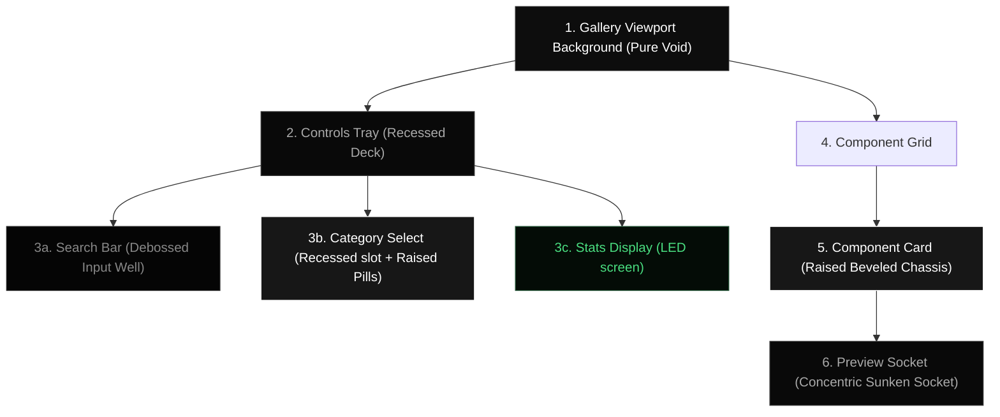

# Design Specification: 3D Beveled Skeuomorphic Gallery Redesign

This specification outlines the design elements, elevation layers, and visual rules for transforming the component gallery of `void/ui` into a tactile, high-friction skeuomorphic control console.

---

## 1. Design Concept: "The Command Deck"

The gallery page will resemble a physical synthesizer console or control deck, with a matte dark charcoal chassis hosting deeply recessed slots, interactive toggles, and glowing indicator screens.



---

## 2. Technical Token Specifications

To ensure consistency with the props panel specification, we will define utility classes in `globals.css` using the exact mathematical values for lighting shadows:

### A. Viewport background (Chassis Base)
*   **Color**: `#0b0a0a`
*   **Chassis Texture**: Optional faint grid overlay.

### B. Recessed Controls Deck (Dashboard Tray)
*   **Class**: `.skeuo-dashboard-deck`
*   **Aesthetic**: A long, machined pocket cut horizontally across the top console to house filters and tools.
*   **Background**: `#070707` (Matte Obsidian)
*   **Borders**: `1px solid rgba(255, 255, 255, 0.04)`
*   **Shadow**: `inset 0 2px 5px rgba(0, 0, 0, 0.95), 0 1px 0 rgba(255, 255, 255, 0.05)`

### C. Debossed Input Well (Search Box)
*   **Class**: `.skeuo-input-well`
*   **Aesthetic**: Deeply set parameter socket.
*   **Background**: `#040404` (Deep Void Black)
*   **Borders**: `1px solid rgba(255, 255, 255, 0.05)` (transitions to `focus:border-white/20`)
*   **Shadow**: `inset 0 1.5px 3px rgba(0, 0, 0, 0.75)`

### D. Tactical Toggles (Tabs & Filter Pills)
*   **Class**: `.skeuo-active-pill`
*   **Aesthetic**: Solid button pushing out of its slot when selected.
*   **Background**: Solid `#ffffff` (White), text color `#000000`
*   **Borders**: `1px solid rgba(255, 255, 255, 0.35)`
*   **Shadow**: `0 2.5px 5px rgba(0, 0, 0, 0.45)` (casting shadow onto the sunken socket)

### E. Digital LED Display (Stats Panel)
*   **Class**: `.skeuo-led-display`
*   **Aesthetic**: Glowing digital output screen showing data variables.
*   **Background**: `#040a06` (Recessed Green LED Void)
*   **Borders**: `1px solid rgba(74, 222, 128, 0.15)`
*   **Shadow**: `inset 0 1.5px 3px rgba(0, 0, 0, 0.85)`
*   **Text**: `#4ade80` (Green LED) with a subtle text shadow glow (`0 0 4px rgba(74, 222, 128, 0.4)`)

### F. Raised Beveled Card (Component Card)
*   **Class**: `.skeuo-bevel-card`
*   **Aesthetic**: Machined polymer card block sitting high above the grid with a sharp, specular bevel on top and ambient occlusion on bottom.
*   **Background**: `#171717` (Dark Charcoal Matte)
*   **Borders**:
    *   *Top*: `border-top: 1px solid rgba(255, 255, 255, 0.22)`
    *   *Sides*: `border-left/right: 1px solid rgba(255, 255, 255, 0.02)`
    *   *Bottom*: `border-bottom: 1px solid rgba(255, 255, 255, 0.10)`
*   **Shadow**:
    ```css
    box-shadow:
      inset 0 1.5px 0 0 rgba(255, 255, 255, 0.08),  /* Top highlight */
      inset 0 -1.5px 0 0 rgba(0, 0, 0, 0.45),         /* Bottom lip shade */
      0 4px 6px -1px rgba(0, 0, 0, 0.8),             /* Ambient occlusion */
      0 2px 4px -1px rgba(0, 0, 0, 0.9),             /* Occlusion secondary */
      0 20px 50px rgba(0, 0, 0, 0.55);               /* Soft drop shadow */
    ```

### G. Concentric Inner Socket (Preview Area)
*   **Class**: `.skeuo-inner-socket`
*   **Aesthetic**: Cutout within the card face where the component preview is exposed.
*   **Background**: `#070707`
*   **Borders**: `1px solid rgba(255, 255, 255, 0.05)`
*   **Shadow**: `inset 0 2px 4px rgba(0, 0, 0, 0.85)`

---

## 3. Visual Layout Interactions

1.  **Chassis Grid**: The current grid layout has simple borders (`border-[#1f1f1f]`). We will update this to have slightly wider gaps (`gap-4` or `gap-6`) and display individual cards as raised elements. A dense grid with borders works well for flat designs, but a physical card layout looks much better with spacing, letting the soft drop shadows anchor each card individually.
2.  **Spring Animations**:
    *   Category tab clicks will trigger a spring animation using Framer Motion (reminiscent of mechanical keyboard press depth).
    *   Hovering over a component card will slightly increase its specular gloss (`border-top` opacity increases) and lift it slightly (`translateY(-2px)`), casting a wider low-frequency drop shadow.
3.  **Active Indicator Lights**: Category buttons will feature a tiny "dot LED" next to their label. When a category is active, the LED turns on (solid neon color reflecting the category accent: e.g. purple, gold, emerald), adding to the synthesizer console vibe.
