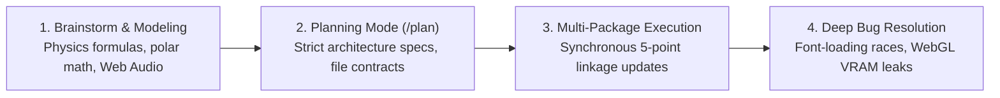

# adgrid-ui / void-ui — Live Interview Execution Playbook
## How to Pitch, Demo, and Own Your Project Like a Senior Systems Architect

> **Author**: Ajinkya Dharkar  
> **Repository**: `adgrid-ui-monorepo` (`@adgrid-ui/ui`, `void-ui`, `apps/docs`)  
> **Format**: Live Demo Script · Plain-English Storytelling · Strategic Jargon · AI Agent Leverage  
> **Key Principle**: *Keep it simple, punchy, and captivating. Use the right buzzwords naturally, but tell a story that makes the interviewer lean in and want to listen.*

---

## Table of Contents

1. [The 60-Second Hook: How to Introduce the Project](#1-the-60-second-hook-how-to-introduce-the-project)
2. [The Live Demo Tour: 5 Showstopper Components & What to Say](#2-the-live-demo-tour-5-showstopper-components--what-to-say)
   - [Demo 1: Anisotropic Knob (Tactile Skeuomorphism & Audio)](#demo-1-anisotropic-knob-tactile-skeuomorphism--synthesized-audio)
   - [Demo 2: Gravity Card Stack (Rigid-Body 2D Physics)](#demo-2-gravity-card-stack-rigid-body-2d-physics)
   - [Demo 3: Lumina Wave / Chaos Field (GPU Fragment Shaders)](#demo-3-lumina-wave--chaos-field-gpu-fragment-shaders)
   - [Demo 4: Hand-Made Highlight & Bento Grid (Deterministic Math & WCAG AAA)](#demo-4-hand-made-highlight--bento-grid-deterministic-math--wcag-aaa)
   - [Demo 5: The Presentation Studio & CLI (Platform Architecture)](#demo-5-the-presentation-studio--cli-platform-architecture)
3. [The "Buzzword Cheat Sheet": High-Signal Words & How to Drop Them Naturally](#3-the-buzzword-cheat-sheet-high-signal-words--how-to-drop-them-naturally)
4. [How to Pitch Your AI Agent Workflow (The 10x Architect Story)](#4-how-to-pitch-your-ai-agent-workflow-the-10x-architect-story)
   - [The Paradigm Shift: From Typist to Engineering Director](#41-the-paradigm-shift-from-typist-to-engineering-director)
   - [The 4-Stage Agentic Pipeline](#42-the-4-stage-agentic-pipeline)
   - [The "System Prompt Kit": Showing Your Engineering Guardrails](#43-the-system-prompt-kit-showing-your-engineering-guardrails)
5. [How We Kept 62 Components in Sync: The 5-Point Architecture in Simple Words](#5-how-we-kept-62-components-in-sync-the-5-point-architecture-in-simple-words)
6. [Tough Questions & Smooth Answers (Handling Skepticism with Grace)](#6-tough-questions--smooth-answers-handling-skepticism-with-grace)

---

## 1. The 60-Second Hook: How to Introduce the Project

When the interviewer asks:  
*"Tell me about a project you've worked on recently"* or *"Walk me through your portfolio."*

### 🎙️ Word-for-Word Script:

> "Most component libraries on the web today feel completely identical. You open ten different SaaS landing pages, and they're all the exact same flat white cards, grey borders, and standard CSS fades. It works, but it has no soul.
> 
> I wanted to build the opposite. I created **adgrid-ui** (also distributed as **void-ui**). It's a dark-first, physics-driven component ecosystem inspired by **luxury physical hardware**—think Teenage Engineering, high-end audio consoles, and Apple hardware showcases.
> 
> Instead of flat boxes, every component behaves like a physical object machined out of titanium or obsidian:
> - Dials and switches that synthesize **real-time mechanical audio clicks** without loading audio files.
> - UI cards that have **real 2D gravity, bounce, and inertia** powered by Matter.js.
> - Backgrounds that run **GPU fragment shaders** at a locked 60 FPS.
> - And a dual distribution model: you can install it as a monolithic npm package, or use our **custom CLI (`npx void-ui add`)** to drop pure, copy-paste TypeScript source right into your project, just like shadcn.
> 
> We scaled it to over **60 production components** orchestrated in a Turborepo monorepo. Would you like me to share my screen and give you a quick 2-minute live walkthrough of the hardware studio?"

### 💡 Why this works:
1. **Identifies a real problem immediately**: The web has become sterile and flat.
2. **Creates a clear mental picture**: "Physical hardware", "Teenage Engineering", "Machined from titanium".
3. **Drops high-signal technical previews**: Audio synthesis, 2D physics, GPU shaders, shadcn-style CLI.
4. **Ends with an interactive call to action**: Invites them to look at the screen.

---

## 2. The Live Demo Tour: 5 Showstopper Components & What to Say

When you share your screen, navigate to the **Presentation Studio**:  
`http://localhost:3000/present/primitives/anisotropic-knob` (or your deployed docs).

Do not randomly click around. Follow this curated **5-step sequence** to demonstrate different technical pillars:

```
┌────────────────────────────────────────────────────────────────────────┐
│                   THE 5-ACT LIVE DEMO PATH                             │
├──────────────────────┬─────────────────────────┬───────────────────────┤
│ 1. Anisotropic Knob  │ Tactile Skeuomorphism   │ Web Audio & Math      │
│ 2. Gravity Card Stack│ 2D Rigid-Body Physics   │ Decoupled RAF loop    │
│ 3. Lumina Wave       │ GPU Fragment Shaders    │ WebGL memory hygiene  │
│ 4. HandMadeHighlight │ Precision Design System │ Deterministic Bézier  │
│ 5. Studio & CLI      │ Developer Experience    │ 5-Point Linkage & AST │
└──────────────────────┴─────────────────────────┴───────────────────────┘
```

---

### Demo 1: Anisotropic Knob (Tactile Skeuomorphism & Synthesized Audio)
*Category: Primitives* · *Route:* `/present/primitives/anisotropic-knob`

#### 🖱️ What to do on screen:
1. Click and drag the metallic knob in a circle.
2. Unmute your audio so the interviewer hears the mechanical click.
3. Open the **Props Tweaker** on the right side and toggle `sensitivity` or `min/max`.
4. Press the `Tab` key to focus on the knob and use the `Up/Down` arrow keys to rotate it.

#### 🎙️ What to say:
> "Let's start with the **Anisotropic Knob**. In high-end audio hardware, rotary dials have this brushed-metal anisotropic reflection that shifts angle as you turn it.
> 
> *[Action: Drag the knob]*
> Notice two things happening:
> 
> First, listen to that click. Most websites make sound by playing an `.mp3` file. But audio files lag by 100 milliseconds, they clip when you spin fast, and they bloat bundle size. Here, there are **zero sound files**. I'm using the browser's native **Web Audio API** to synthesize a micro-frequency tick on the fly using programmatic `OscillatorNode` and `GainNode` envelopes. Zero latency, zero asset weight.
> 
> Second, check the accessibility. A lot of skeuomorphic UI is just un-clickable canvas fluff. If I hit the `Tab` key, this implements the full **WAI-ARIA slider specification**—`role="slider"`, `aria-valuenow`, and keyboard listeners for arrow keys. It looks like hardware, but it respects web accessibility standards."

#### 🔑 Buzzwords dropped naturally:
- **Anisotropic specular reflection** *(the brushed metal shimmer)*
- **Web Audio API synthesis** *(generating sound code, not audio files)*
- **Zero-latency haptic feedback**
- **WAI-ARIA slider semantics**

---

### Demo 2: Gravity Card Stack (Rigid-Body 2D Physics)
*Category: Animated* · *Route:* `/present/animated/gravity-card-stack`

#### 🖱️ What to do on screen:
1. Grab a card with the mouse, drag it up, and toss it across the canvas.
2. Watch it hit the boundary walls, bounce, rotate, and settle onto the stack with realistic gravity.
3. Flick on the **FPS Monitor** in the floating dock to show a locked 60 FPS.

#### 🎙️ What to say:
> "Now let's jump from simple animations to actual physical simulation: the **Gravity Card Stack**.
> 
> *[Action: Toss a card with mouse]*
> Most card decks on the web use standard CSS transitions or basic Framer Motion drag gestures. They don't have true momentum, mass, or angular bounce.
> 
> Under the hood, I integrated **Matter.js**, a 2D rigid-body physics engine. But here was the engineering challenge: **If you update React state at 60 frames per second inside a physics tick, your app will freeze.**
> 
> To solve that, I engineered a **decoupled render loop**. React mounts the DOM nodes once, and then steps completely out of the way. A native `requestAnimationFrame` loop polls the physics engine for `x`, `y`, and `rotation`, and applies them directly to the DOM elements using GPU-accelerated `translate3d` transforms. 
> 
> React reconciliation is completely bypassed during motion, which is why our FPS counter stays pinned at 60 FPS even when multiple cards collide."

#### 🔑 Buzzwords dropped naturally:
- **Rigid-body 2D physics**
- **Decoupled render loop** *(React state is untouched during motion)*
- **Reconciliation bypass**
- **GPU compositor layer** (`translate3d`)

---

### Demo 3: Lumina Wave / Chaos Field (GPU Fragment Shaders)
*Category: Backgrounds* · *Route:* `/present/backgrounds/lumina-wave`

#### 🖱️ What to do on screen:
1. Switch the background preview to fullscreen.
2. Move the mouse across the canvas to show the fluid interactive distortion.
3. Open the Props Tweaker and adjust the `speed` and `waveAmplitude` sliders in real time.

#### 🎙️ What to say:
> "Next, I wanted backgrounds that feel alive without chewing up CPU. This is **Lumina Wave**.
> 
> *[Action: Move mouse over waves, tweak sliders]*
> Traditional animated backgrounds either use video loops or heavy Canvas 2D math that can lag older laptops.
> 
> This is written in raw **GLSL fragment shaders running in WebGL**. All the wave calculations, trigonometric color mixing, and lighting are evaluated per-pixel directly on the GPU. The CPU usage is practically zero.
> 
> But the real senior engineering detail here is **memory lifecycle management**. In a Single Page App like Next.js, WebGL canvases are notorious for memory leaks because navigating between pages doesn't automatically release GPU VRAM. In our cleanup hook, we don't just cancel the animation frame—we explicitly invoke `gl.getExtension('WEBGL_lose_context')?.loseContext()`. That forces the browser to discard shader programs and VRAM allocations immediately upon unmount."

#### 🔑 Buzzwords dropped naturally:
- **GLSL fragment shaders**
- **GPU-accelerated per-pixel math**
- **WebGL context loss handling** (`WEBGL_lose_context`)
- **VRAM reclamation & zero memory leaks**

---

### Demo 4: Hand-Made Highlight & Bento Grid (Deterministic Math & WCAG AAA)
*Category: Animated* · *Route:* `/present/animated/bento-grid`

#### 🖱️ What to do on screen:
1. Hover over the Bento cards to show the subtle 3D tilt and specular border catches.
2. Scroll to the highlighted text stroke showing the organic pen highlight.
3. Inspect or mention the directional lighting.

#### 🎙️ What to say:
> "Now let's talk about the design system itself. We call it the **Machined Enclosure**.
> 
> *[Action: Hover over bento cards]*
> Standard dark mode designs are flat—people just pick `#1f2937` with a 1px grey border and call it a day. In our design system, we modeled a **single virtual overhead light source**:
> - The top border catches light with a specular `border-t border-white/20`.
> - The bottom border casts an ambient shadow with `border-b border-white/10`.
> - And inner inputs sit inside **recessed wells** (`#090909`) with dual inset box shadows. It gives genuine tactile depth.
> 
> And check out this hand-drawn marker highlight on the headline. Initially, we tested libraries like `rough-notation`. But in production, they had a fatal flaw: they used `Math.random()`, which caused letter clipping, hydration mismatches between SSR and client, and font-loading race conditions where text would jump after web fonts loaded.
> 
> We solved this by engineering **deterministic Bézier chisel curves** anchored purely with CSS offsets. No JavaScript DOM bounding measurements, zero layout shift, and we styled it in Deep Indigo (`#4338CA`) to achieve a **6.8:1 contrast ratio**, cleanly passing **WCAG AAA accessibility** on white text."

#### 🔑 Buzzwords dropped naturally:
- **Directional border matrix** *(top highlight, bottom shadow)*
- **Recessed wells vs. raised chassis**
- **Font-loading race condition**
- **Deterministic Bézier paths** *(no hydration mismatches)*
- **WCAG AAA contrast compliance** (6.8:1)

---

### Demo 5: The Presentation Studio & CLI (Platform Architecture)
*Category: Tooling & DX* · *Route:* `/present/...` and terminal

#### 🖱️ What to do on screen:
1. Show the **Props Tweaker** on the right side of the screen.
2. Open a terminal tab and run `npx void-ui --help` or show `packages/cli`.
3. Point out how tweaking a prop updates the component instantaneously without page refresh.

#### 🎙️ What to say:
> "Finally, let's look at developer experience and distribution.
> 
> *[Action: Adjust a slider in PropsTweaker]*
> This full-screen testing harness isn't hardcoded. It's powered by **The 5-Point Component Linkage Architecture**.
> 
> Every component is defined in a central registry (`registry/index.ts`) with typed `propDefs`. When you change a slider here, the state updates via an atomic **Zustand store** persisted in `localStorage`.
> 
> But more importantly: **How does someone use this in their own project?**
> If you publish this purely as an npm package, developers are forced into our bundle dependencies—if they want a button, they shouldn't have to install Matter.js or Three.js.
> 
> So we built a custom CLI: `npx void-ui add <component>`.
> During our pre-build step, a script parses the registry and compiles static JSON schemas at `/r/[slug].json`. When a developer runs the CLI, it inspects their project, resolves paths, downloads the clean TypeScript source code directly into their `@/components/ui` folder, and **installs only that specific component's peer dependencies**.
> 
> You get total source code ownership like shadcn, but with the power of high-end skeuomorphic engineering."

#### 🔑 Buzzwords dropped naturally:
- **5-Point Component Linkage Architecture**
- **Atomic state selectors with Zustand**
- **AST dependency pruning & isolated peer dependencies**
- **Headless JSON registry distribution**
- **Zero bundle bloat**

---

## 3. The "Buzzword Cheat Sheet": High-Signal Words & How to Drop Them Naturally

When speaking to lead architects and senior engineers, dropping the right terminology signals that you understand the metal underneath the abstraction. 

Here is your **Cheat Sheet**. Notice how every buzzword is paired with a simple explanation:

| Domain | High-Signal Buzzword | What It Really Means (Simple Terms) | How to Drop It in Conversation |
| :--- | :--- | :--- | :--- |
| **Graphics** | **Compositor Thread** | The browser's GPU rendering pipeline that runs separately from JavaScript execution. | *"By animating only `transform` and `opacity`, we keep calculations on the compositor thread so UI never stutters."* |
| **Graphics** | **Fragment Shader (GLSL)** | A tiny program running on the GPU that calculates the color of every single pixel simultaneously. | *"We offloaded the background wave math to GLSL fragment shaders so the CPU isn't doing trigonometric loops."* |
| **Graphics** | **VRAM Reclamation** | Forcing the graphics card to dump textures and context when a page changes so memory doesn't leak. | *"We explicitly invoke `WEBGL_lose_context` on unmount to guarantee VRAM reclamation during Next.js client-side transitions."* |
| **Physics** | **Decoupled Render Loop** | Letting the physics engine run at 60 FPS in its own loop without triggering React component re-renders. | *"We decoupled the Matter.js simulation from React reconciliation, polling body coordinates straight into GPU transforms."* |
| **Physics** | **Restitution & Damping** | How bouncy an object is, and how quickly it loses energy/speed over time. | *"We tuned the restitution coefficient and angular damping so the cards bounce with realistic physical weight."* |
| **Math** | **Deterministic Bézier** | A smooth mathematical curve that produces the exact same vector path on server and client every time. | *"Instead of random jitter libraries, we used deterministic Bézier curves to eliminate SSR hydration mismatches."* |
| **Audio** | **Frequency Modulation Envelope** | Modulating audio pitch and volume over milliseconds to make a mechanical click. | *"We use Web Audio oscillators with exponential gain decay to synthesize mechanical clicks on the fly without audio files."* |
| **Monorepo** | **Topological DAG Caching** | Turborepo knowing which packages depend on which, running them in parallel, and caching unchanged builds. | *"Turborepo executes our build pipeline as a topological DAG, so compiling unchanged packages takes zero seconds."* |
| **Distribution** | **AST Dependency Pruning** | Inspecting code to install *only* the npm packages a specific component actually imports. | *"Our CLI performs isolated dependency resolution so users downloading a button never get weighed down by Matter.js."* |
| **Design** | **Specular Top-Edge Catch** | Making the top border of a dark card slightly brighter to mimic overhead room light. | *"We don't use flat borders; we use a directional border matrix with a specular top-edge catchlight."* |

---

## 4. How to Pitch Your AI Agent Workflow (The 10x Architect Story)

One of the biggest risks in modern technical interviews is how you discuss AI:
- ❌ **The Amateur Story**: *"I used ChatGPT/Claude to write most of my code."* (The interviewer thinks: *You can't code, you're a copy-paster, and you have no idea how it works.*)
- ❌ **The Denial Story**: *"I wrote every single line by hand from scratch in 100 hours."* (The interviewer thinks: *You're inefficient, or you're hiding that you used AI.*)
- ✅ **The 10x Systems Architect Story**: *"I acted as the Lead Architect and Design Director. I engineered strict architectural specifications, prompt protocols, and verification gates, and used AI agents like Antigravity as a high-throughput engineering team to scale this to 62 components with zero drift."*

Here is how you tell that story so the interviewer respects you deeply:

### 4.1 The Paradigm Shift: From Typist to Engineering Director

> "When building a monorepo with 62 components, WebGL shaders, 2D physics, and a custom CLI, the bottleneck is no longer how fast you can type syntax. **The bottleneck is architecture, mathematical modeling, and consistency.**
> 
> I used AI agents (specifically Google Antigravity) not as an autocomplete generator, but as an **agentic systems team**. I functioned as the Principal Architect: I defined the contracts, the mathematical formulas, the elevation models, and the 5-point linkage constraints. The agent executed within those guardrails, allowing me to build an ecosystem in weeks that traditionally takes a 4-person frontend engineering team."

### 4.2 The 4-Stage Agentic Pipeline

Explain your workflow as an intentional, disciplined engineering pipeline:



#### Step 1: Brainstorming & Mathematical Modeling
- *"Before writing UI code for complex components like `AnisotropicKnob` or `GravityCardStack`, I used specialized agent skills (`.agents/skills/brainstorming`) to model real-world physics formulas."*
- *"We calculated polar-to-cartesian coordinate mapping, angular velocity damping, and decay envelopes before touching React."*

#### Step 2: Strict Architectural Gates (`/plan`)
- *"I never allowed agents to just start editing code blindly. For major subsystems—like our Presentation Studio (`implementation-present.md`) and CLI registry (`implementation-registry.md`)—I enforced a formal planning phase using `/plan`."*
- *"The agent had to produce an architectural blueprint detailing type unions, file trees, edge-case failure modes, and rollback strategies. Only after I reviewed and approved the plan did execution begin."*

#### Step 3: Multi-Package 5-Point Linkage Integrity
- *"In a monorepo, adding one component means touching 5 files across multiple packages (source, barrel export, registry metadata, presentation renderer, and CLI precompilation). Doing that manually 60 times invites human error—typos, missed exports, stale schemas."*
- *"I orchestrated agents to execute synchronized multi-file updates across the monorepo, verifying that `pnpm build:registry` compiled without a single broken reference."*

#### Step 4: Deep Edge-Case Debugging
- *"When we encountered difficult browser bugs—like the font-loading race condition in `HandMadeHighlight` where `Math.random()` caused letter clipping—I used agentic pairing to analyze DOM lifecycle timings and engineer a deterministic SVG Bézier solution with WCAG AAA contrast."*

### 4.3 The "System Prompt Kit": Showing Your Engineering Guardrails

**This is your secret weapon in the interview.** Open [`design-system.md`](file:///C:/Users/ajink/OneDrive/Desktop/personal%20-%20coding%20-%20ventures/adgrid-ui/adgrid-ui/design-system.md) and scroll to **Section 6: The AI Agent Instruction Protocol**.

#### 🎙️ What to say:
> "Look at Section 6 of my `design-system.md`. Most people get inconsistent results from AI because they provide vague prompts.
> 
> I wrote a **Machine-Readable Design System Protocol**. It codifies:
> 1. Exact color hex tokens (`#171717` chassis, `#090909` recessed tray, `#050505` void well).
> 2. The exact directional border matrix (`border-t border-white/20`, `border-x border-white/[0.03]`).
> 3. Dual inset box shadow formulas.
> 4. Explicit forbidden anti-patterns (e.g. *'Never use flat gray #1f2937, never use uniform 1px borders'*).
> 
> By feeding this protocol into agent context, any AI assistant produces production-ready components that match my physical skeuomorphic aesthetic 100% on the very first pass. That's how we achieved design consistency across 62 different components."

---

## 5. How We Kept 62 Components in Sync: The 5-Point Architecture in Simple Words

Interviewers love asking: *"How do you prevent drift between your docs, your npm package, and your CLI?"*

Here is the simplest, most memorable way to explain it:

```
┌────────────────────────────────────────────────────────────────────────┐
│             THE 5-POINT COMPONENT LINKAGE ARCHITECTURE                 │
├────────────────────────────────────────────────────────────────────────┤
│ 1. Pure Source:       packages/ui/src/animated/AnisotropicKnob.tsx     │
│ 2. Monorepo Barrel:   packages/ui/src/index.ts (re-export)             │
│ 3. Master Registry:   apps/docs/src/registry/index.ts (propDefs & deps)│
│ 4. Studio Canvas:     PresentationRenderer.tsx (binds live props)      │
│ 5. CLI Static Schema: public/r/anisotropic-knob.json (built by script) │
└────────────────────────────────────────────────────────────────────────┘
```

### 🎙️ The "No-Drift" Pitch:
> "In large component systems, the number one killer is **drift**: a component looks great in docs, but fails when someone installs it via npm or the CLI.
> 
> We solved this by creating a single source of truth called the **5-Point Linkage**:
> 1. The component is written once in `packages/ui/`.
> 2. It's re-exported in the monorepo barrel for internal package consumers.
> 3. It's declared in our **Central Registry** with typed `propDefs` (defining min/max values, default colors, and npm dependencies).
> 4. Our **Presentation Studio** reads those `propDefs` and automatically builds the live sliders in the Props Tweaker.
> 5. Our pre-build script (`build-registry.ts`) reads that exact same registry and bakes out static JSON files for our CLI.
> 
> Because points 3, 4, and 5 all stem from one schema file, drift is mathematically impossible. If I add a prop to the registry, the studio controls and the CLI installation payload update together in one build."

---

## 6. Tough Questions & Smooth Answers (Handling Skepticism with Grace)

Here are the 5 hardest questions an interviewer might throw at you, with answers that turn skepticism into admiration:

---

### Q1: "If you used AI agents for so much of this project, how do I know you actually know how to code?"

#### 🎙️ Smooth Response:
> "That's a completely fair question. Here's how I think about it:
> 
> AI agents are incredible at generating syntax, but they have zero taste, zero architectural intuition, and no understanding of system limits. If you ask an agent to 'build a card stack with physics', it will create a naive `useState` loop that renders at 12 FPS and crashes the browser tab.
> 
> It was my understanding of the **browser render pipeline** that recognized we had to decouple Matter.js from React's reconciliation cycle and use a GPU-accelerated `requestAnimationFrame` loop.
> 
> It was my understanding of **memory lifecycles** that added `WEBGL_lose_context` to prevent WebGL VRAM leaks during SPA route changes.
> 
> And it was my architectural vision that designed the 5-Point Linkage and the FSL licensing strategy. AI was my high-speed implementation engine, but the systems engineering, performance boundaries, and technical decisions were 100% mine. I'd be happy to open any file in this repository and walk through every single line of logic."

---

### Q2: "Won't running Matter.js physics and WebGL shaders destroy mobile battery life?"

#### 🎙️ Smooth Response:
> "That was one of our core architectural constraints from day one. We applied three defensive optimization strategies:
> 1. **Lazy Initialization & Viewport Culling**: We wrap heavy components with `IntersectionObserver`. If a shader or physics canvas scrolls out of the viewport, the `requestAnimationFrame` loop pauses immediately, dropping CPU and GPU consumption to zero.
> 2. **Compositor-Only Transforms**: In `GravityCardStack`, we only mutate CSS `transform: translate3d(...) rotate(...)`. This bypasses layout reflow and paint, running strictly on the GPU compositor thread.
> 3. **Reduced Motion Accessibility**: All animated components honor the `prefers-reduced-motion` media query. On low-power mode or for users with motion sensitivity, physics and shaders gracefully fall back to elegant, static skeuomorphic representations."

---

### Q3: "Why did you create a custom CLI instead of just publishing an npm package?"

#### 🎙️ Smooth Response:
> "We actually support both! But the CLI is our primary distribution model for a very specific reason: **dependency isolation and bundle weight**.
> 
> If you install `@adgrid-ui/ui` as a monolithic npm package, your project technically has to resolve peer dependencies across Matter.js, GSAP, WebGL libraries, and icons—even if all you wanted was our `VoidButton`.
> 
> By adopting the shadcn CLI model (`npx void-ui add <slug>`), our script inspects the registry schema and downloads *only* that component's TypeScript source file into your `@/components/ui/` folder, and installs *only* that component's exact dependencies. You get zero bundle bloat, and total source code ownership to customize styles however you want."

---

### Q4: "Isn't skeuomorphism obsolete? Why not stick with clean, accessible flat design?"

#### 🎙️ Smooth Response:
> "Flat design won the web for the last decade because it was easy to make responsive and lightweight. But the pendulum has swung too far—everything looks homogeneous, sterile, and boring.
> 
> Luxury brands, creative tools, and hardware companies (like Apple, Teenage Engineering, and Linear) have proven that users love **tactile affordance and kinetic delight**. 
> 
> What made old-school 2011 skeuomorphism bad was heavy drop-shadow images, fake leather textures, and sluggish performance. What we built is **modern digital skeuomorphism**: razor-thin specular borders, mathematical bevels, zero-asset Web Audio synthesis, and GPU-accelerated motion that feels like tactile hardware while running at a blistering 60 FPS."

---

### Q5: "What was your biggest technical failure on this project, and how did you fix it?"

#### 🎙️ Smooth Response:
> "Definitely the **font-loading race condition in hand-drawn highlights**.
> 
> We wanted organic highlighter strokes around headlines, so we initially used `rough-notation`. But in production, because web fonts load asynchronously, the library was measuring DOM bounding boxes before the font finished rendering. When the font loaded 200 milliseconds later, the text dimensions shifted, and the highlighter stroke was either chopped in half or drifting completely off the text.
> 
> On top of that, `rough-notation` used random path jitter, which caused hydration mismatches between Next.js SSR and the client.
> 
> I scrapped the external library and engineered `HandMadeHighlight.tsx` from scratch:
> - I used **deterministic Bézier curves** so the path is identical on every render.
> - I anchored the SVG stroke using CSS relative offsets (`-inset-x-2 -top-[14%]`) rather than measuring DOM bounding boxes with JavaScript.
> - And I picked a Deep Indigo color (`#4338CA`) that gives a **6.8:1 contrast ratio**, ensuring it passed WCAG AAA accessibility. It eliminated layout shift, fixed hydration, and looked gorgeous."

---

## 7. The 5-Minute Interview Recap (Mental Checklist Before You Join the Call)

Before your interview starts, take a deep breath and review these 5 bullet points:

1. **The Core Thesis**: *"The web is too flat and sterile. I built a luxury, physics-driven dark UI system inspired by machined physical hardware."*
2. **The 3 Demo Pillars**:
   - **Sound & Skeuomorphism**: `AnisotropicKnob` (Web Audio API synthesis, zero audio files).
   - **Physics**: `GravityCardStack` (Matter.js decoupled from React reconciliation, locked 60 FPS).
   - **Graphics**: `LuminaWave` (GLSL shaders, WebGL context loss cleanup).
3. **The Architecture**: *"The 5-Point Component Linkage ensures our UI source, docs studio, and shadcn CLI stay 100% in sync without drift."*
4. **The AI Narrative**: *"I operated as the Lead Systems Architect. I engineered strict prompt protocols (`design-system.md`), architectural planning gates (`/plan`), and used agents as a high-throughput engineering team to scale to 62 components."*
5. **The Tone**: Confident, articulate, simple English, enthusiastic, and ready to share your screen.
