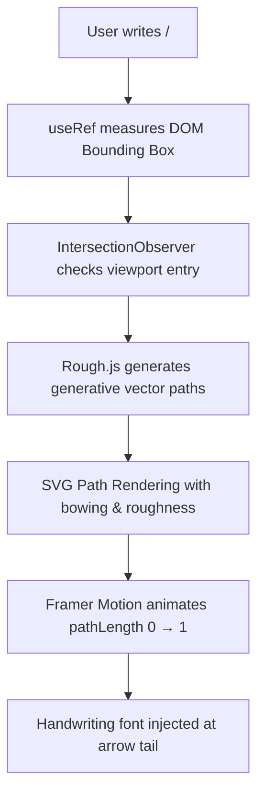

# adgrid-ui / void-ui — The Story & Engineering of "Roughly"
## How We Brought Hand-Drawn Magic to the Web (Explained So Simply a Kid Would Understand)

> **Author**: Ajinkya Dharkar  
> **Repository**: `adgrid-ui-monorepo` (`@adgrid-ui/ui`, `packages/ui/src/animated/roughly/`, `apps/docs/src/app/roughly`)  
> **Aesthetic**: Organic Vector Sketches · Hand-Drawn Tactile Annotations · Playful Humanized Motion  
> **Tone**: Kid-Simple Analogies · Passionate Storytelling · Senior Architectural Craft  

---

## Table of Contents

1. [The Spark: Benji Taylor & The Cold, Robotic Web](#1-the-spark-benji-taylor--the-cold-robotic-web)
2. [The Mission: "I Decided to Build This for the World"](#2-the-mission-i-decided-to-build-this-for-the-world)
3. [How Roughly Works (The "Explain It to a 7-Year-Old" Edition)](#3-how-roughly-works-the-explain-it-to-a-7-year-old-edition)
   - [Step 1: The Invisible Ruler (Measuring the Box)](#step-1-the-invisible-ruler-measuring-the-box)
   - [Step 2: The Shaky Robot Hand (Rough.js & Controlled Wobble)](#step-2-the-shaky-robot-hand-roughjs--controlled-wobble)
   - [Step 3: The Magic Unrolling String (Framer Motion Drawing Reveal)](#step-3-the-magic-unrolling-string-framer-motion-drawing-reveal)
   - [Step 4: The Smart Eyeball (IntersectionObserver)](#step-4-the-smart-eyeball-intersectionobserver)
4. [The 9 Tools in the Pencil Box](#4-the-9-tools-in-the-pencil-box)
5. [The Developer Experience Magic: Why Anyone Can Use It in 5 Seconds](#5-the-developer-experience-magic-why-anyone-can-use-it-in-5-seconds)
6. [The Full Technical Engine Under the Hood](#6-the-full-technical-engine-under-the-hood)
7. [The Live Interview Script (How to Tell This Story to an Interviewer)](#7-the-live-interview-script-how-to-tell-this-story-to-an-interviewer)
8. [Tough Questions & Clever Answers](#8-tough-questions--clever-answers)

---

## 1. The Spark: Benji Taylor & The Cold, Robotic Web

Every great project starts with an emotional reaction to something you saw.

For **Roughly**, that moment happened when I was exploring the personal portfolio website of a famous design engineer named **Benji Taylor**. 

If you look at most websites on the internet today, they feel cold and robotic. Everything is a rigid rectangle with 90-degree corners, sterile blue buttons, and machine-cut straight lines. It feels like an algorithm designed it for other algorithms.

**Benji Taylor’s website was completely different.**  
Scattered across his pages were these gorgeous, hand-drawn annotations. It looked like someone had taken a physical pencil or rough pen and doodled right on top of the website:
- An arrow curving casually toward a link like a sticky note on a fridge.
- A loose, sketchy hand-drawn circle looping around a word twice to say *"Look at this!"*
- A fun little handwritten note scribbled at the tail of an arrow.

It felt alive. It felt warm. It had a **human soul**.

---

## 2. The Mission: "I Decided to Build This for the World"

Seeing Benji Taylor's site gave me goosebumps. But when I looked at how people actually build things like that, I realized there was a massive problem:

**It was almost impossible for regular developers to do.**

If an everyday developer wanted a hand-drawn circle or a curved sketch arrow on their site, what did they have to do?
1. Open Figma or Adobe Illustrator and painfully draw an SVG vector path by hand.
2. Export the SVG and paste a 100-line chunk of ugly XML code into their React project.
3. Hardcode exact pixel positions (`top: 142px, left: 388px`).
4. And the second the website was opened on an iPhone or an iPad, the hardcoded coordinates broke, and the arrow pointed at empty space!

It took hours of manual geometry math just to draw one arrow. It was gatekept behind tedious trial-and-error.

I said to myself:  
> *"Why should hand-crafted beauty be locked away for only elite creative directors? Why can't any 16-year-old student or frontend developer wrap a single word in a tag and get that exact same hand-drawn magic in five seconds?"*

**So I decided to build it for the world.**

I wanted to take that bespoke, hand-drawn aesthetic and turn it into a dead-simple, reusable component system where you just write:
```tsx
<Roughly type="circle">Super Fast</Roughly>
```
...and the browser draws a beautiful, animated sketch around that word automatically, anywhere on any screen.

---

## 3. How Roughly Works (The "Explain It to a 7-Year-Old" Edition)

If an interviewer asks you: *"How does Roughly actually work under the hood?"* — do not drown them in dry mathematical equations. Use these **four fun, simple pictures**:

```
┌────────────────────────────────────────────────────────────────────────┐
│                   HOW ROUGHLY WORKS (IN 4 STEPS)                       │
├───────────────────┬───────────────────┬────────────────────────────────┤
│ 1. Invisible Ruler│ 2. Shaky Robot    │ 3. Magic String │ 4. Smart Eye │
│ Measures the word │ Draws the wobble  │ Unrolls stroke  │ Waits for you│
└───────────────────┴───────────────────┴────────────────────────────────┘
```

---

### Step 1: The Invisible Ruler (Measuring the Box)
> 🧸 **The Kid Analogy**:  
> *"Before you draw a circle around your dog, you have to look at how big your dog is, right? If you just close your eyes and draw, you'll poke your dog in the nose!"*

In code, before we can sketch an underline or circle, the computer needs to know how big the target text is.
- React places an invisible measuring tape (`ref`) on the word.
- It asks the browser: *"Hey, how many pixels wide is the word 'Super', and how tall is it?"*
- Once we have the width and height, we know the exact playground box where our pen is allowed to draw.

---

### Step 2: The Shaky Robot Hand (Rough.js & Controlled Wobble)
> 🧸 **The Kid Analogy**:  
> *"If you ask a robot to draw a circle, it uses a math compass and draws a perfectly cold, round shape. But if a human draws a circle, your hand wobbles just a little bit, and you loop around twice. That imperfection is what makes it look friendly."*

Computers are naturally too perfect. To make lines look human, we used the underlying concepts of **Rough.js**.
- Instead of calculating a straight line from Point A to Point B, the engine introduces **micro-imperfections**:
  - **Roughness**: How much the pen wiggles and shakes.
  - **Bowing**: How much the line naturally bends like an arm resting on a desk.
  - **Iterations**: Drawing the stroke **two times** instead of once, creating that authentic, sketchy notebook feel where the two lines don't quite overlap.

---

### Step 3: The Magic Unrolling String (Framer Motion Drawing Reveal)
> 🧸 **The Kid Analogy**:  
> *"Imagine the drawing is made out of a piece of colored thread. At first, the thread is rolled up tightly into an invisible ball. Then, someone pulls the string so fast across the paper that it looks like an invisible ghost is sketching the line right before your eyes!"*

In SVG graphics, this is called **path length animation**.
- An SVG line has a total length (let's say 300 pixels).
- We tell the browser: *"Hide the whole line at `0%`."*
- Then we use **Framer Motion** (`motion.path`) to smoothly unroll the line from `0%` to `100%` over 800 milliseconds.
- To the human eye, it looks like an invisible fountain pen is gliding across the screen in real-time.

---

### Step 4: The Smart Eyeball (IntersectionObserver)
> 🧸 **The Kid Analogy**:  
> *"If an invisible ghost draws a cool picture at the bottom of the page while you're still reading the top, you completely missed the magic show!"*

We don't want the animations playing in the dark where nobody can see them.
- We attached a **Smart Eyeball** (`IntersectionObserver`) to every component.
- The pen stays completely asleep with the cap on while the word is off-screen.
- The exact millisecond the user scrolls down and the word enters their view, the Smart Eyeball whispers *"Now!"*—and the pen springs to life and draws the animation right in front of them.

---

## 4. The 9 Tools in the Pencil Box

Just like opening a physical pencil case with markers, highlighters, and pens, **Roughly** gives developers **9 distinct hand-drawn tools**:

```
┌────────────────────────────────────────────────────────────────────────┐
│                        THE 9 ROUGHLY TOOLS                             │
├────────────────┬───────────────────┬───────────────────────────────────┤
│ 1. Underline   │ 2. Circle         │ 3. Box                            │
│ 4. Bracket     │ 5. Strike-Through │ 6. Cross-Off                      │
│ 7. Highlight   │ 8. Arrow          │ 9. Handwriting Labels             │
└────────────────┴───────────────────┴───────────────────────────────────┘
```

| # | Tool Name | Component | What It Looks Like | Real-World Use Case |
| :--- | :--- | :--- | :--- | :--- |
| 1 | **Underline** | `<RoughUnderline>` | Single line, double sketch lines, or playful wavy zigzag. | Emphasizing key words in headlines or blog posts. |
| 2 | **Circle** | `<RoughCircle>` | Two loose, sketchy loops hugging the text with breathing room. | Circling special price tags, stats, or badges. |
| 3 | **Box** | `<RoughBox>` | A slightly crooked hand-drawn rectangle around a block. | Framing feature callouts or coupon codes. |
| 4 | **Bracket** | `<RoughBracket>` | Hand-drawn curly `{` or square `[` brackets on any side (left, right, top, bottom). | Grouping multi-line list items or testimonials. |
| 5 | **Strike-Through** | `<RoughStrike>` | A quick pen line (single, double, or triple) slashing through words. | Showing crossed-out old prices (e.g. ~~$99~~ $49). |
| 6 | **Cross-Off** | `<RoughCross>` | A sketchy "X" scribbled over an item. | Interactive to-do lists or discarded features. |
| 7 | **Highlight** | `<RoughHighlight>` | A soft, semi-transparent watercolor marker wash behind the text. | Highlighting quotes without obscuring text readability. |
| 8 | **Arrow** | `<RoughArrow>` | Dynamic curved, straight, or S-curve arrows with open or filled arrowheads. | Guiding the user's eye directly to a CTA button. |
| 9 | **Handwriting** | `<RoughHandwriting>` | Doodle notes written in real cursive script (`Caveat`, `Reenie Beanie`, `Kalam`). | Fun sticky-note commentary attached to arrow tails. |

---

## 5. The Developer Experience Magic: Why Anyone Can Use It in 5 Seconds

The real engineering triumph of Roughly isn't just that it looks pretty. **It's how ridiculously easy it is for any developer to use.**

### Look at the Before and After:

#### ❌ The Old Nightmare (How people built this before):
```tsx
// 80 lines of hardcoded SVG coordinates, broken on mobile, manual CSS keyframes
<svg className="absolute -top-12 -left-20 w-48 h-32" viewBox="0 0 200 100">
  <path d="M 10,80 Q 52.5,10 95,80 T 180,80" fill="none" stroke="#F59E0B" strokeWidth="2" strokeDasharray="300" strokeDashoffset="300" className="animate-draw" />
  <polygon points="175,75 185,80 175,85" fill="#F59E0B" />
</svg>
<p>Deploy your website</p>
```

#### ✅ The Roughly Way (One intuitive line):
```tsx
import { RoughArrow } from "@adgrid-ui/ui";

<RoughArrow placement="top-right" label="Takes only 5 seconds!" color="#F59E0B">
  <button>Deploy Your Website</button>
</RoughArrow>
```

### Why Developers Fall in Love With This:
1. **Zero Math Required**: The developer doesn't need to know trigonometry, Bézier control points, or SVG viewBoxes. They just say `placement="top-right"` and Roughly calculates all the angles automatically.
2. **Auto-Responsive**: If the button gets wider on desktop or shrinks on mobile, Roughly re-measures the boundary box and adjusts the arrow trajectory dynamically.
3. **The Universal `<Roughly>` Facade**: If someone doesn't want to import 9 different components, they can just use the single master wrapper:
   ```tsx
   <Roughly type="circle" color="#6366F1">Designed for human beings</Roughly>
   <Roughly type="underline" variant="wavy" color="#10B981">Super fast</Roughly>
   ```

---

## 6. The Full Technical Engine Under the Hood

Even though we explain it simply to an interviewer, they should know that you built a serious, battle-tested engineering system:



### 1. Generative Vector Geometry (`roughjs` & `rough-notation`)
We didn't draw static SVGs in Illustrator. We use the mathematical principles of **Rough.js** to generate paths programmatically at runtime.
- For arrows: We compute a quadratic or cubic Bézier curve between the arrow's tail and the target's edge, calculate the tangent angle at the tip, and draw a sketchy arrowhead aligned with the vector's trajectory.
- For circles and boxes: We apply an intentional two-pass offset so the loop looks drawn by hand rather than a machine stamping a shape.

### 2. Spring Physics & Kinetic Animation (Framer Motion)
Instead of linear CSS keyframe transitions, stroke drawing speeds are governed by easing curves and spring physics. The pen accelerates slightly at the start of a stroke and eases to a natural stop at the tip, mirroring the physical inertia of a human hand holding a pen.

### 3. Google Handwriting Font Integration
For `<RoughHandwriting>` and `<RoughArrow label="...">`, we integrated three distinct cursive font families:
- **`Caveat`**: A natural, clean marker pen script.
- **`Reenie Beanie`**: A quirky, thin ballpoint pen doodle style.
- **`Kalam`**: A bold, friendly handwriting font.

We added an optional `labelRotate` property (e.g. `rotate: -8°`) so the callout text sits at a playful tilt, looking like an actual human scribbled a quick thought in the margin of a notebook.

### 4. The 112KB Interactive Studio (`apps/docs/src/app/roughly/page.tsx`)
To prove to the world that this was ready for production, we built an entire interactive documentation playground in our Next.js app:
- Tabbed workspace to test all 9 annotation tools live.
- Real-time sliders for stroke width, roughness, bowing, colors, and durations.
- A live code viewer that updates the exact React code snippet as you tweak sliders, with a one-click **"Copy Code"** button.

---

## 7. The Live Interview Script (How to Tell This Story to an Interviewer)

Here is your exact, word-for-word narrative when an interviewer asks:  
*"Tell me about a component you designed from scratch that you're proud of."*

---

### 🎙️ The Script:

> "One of my absolute favorite parts of this project is a component suite I built called **Roughly**.
> 
> The inspiration came from a famous design engineer named **Benji Taylor**. I was browsing his personal website one afternoon, and he had these playful, hand-drawn pencil and pen doodles dancing across his pages—arrows curving toward buttons, circles looping around key words, little handwritten notes in the margins.
> 
> It made the site feel so warm, creative, and human. But when I looked at how developers build things like that today, I realized it was a total nightmare. Developers had to draw paths by hand in Figma, export massive SVGs, and hardcode pixel coordinates that broke on every mobile screen.
> 
> I said: *Why does this have to be so hard? Why can't any developer wrap a word in a single React tag and get that hand-drawn magic instantly?*
> 
> So I decided to build it for the world.
> 
> The mental model is super simple—it's like having an invisible artist with a shaky hand and a magic pencil:
> 1. First, an invisible ruler measures the exact width and height of the word on screen.
> 2. Then, we use the vector math of **Rough.js** to add controlled 'wobble'—a little roughness and bowing—so the line feels like a human hand drew it instead of a cold computer.
> 3. Then, **Framer Motion** unrolls the line from 0% to 100% like a piece of colored string, making it look like a pen is sketching it live.
> 4. And an **IntersectionObserver** acts as an eyeball, making sure the pen only draws when the user actually scrolls to that word.
> 
> I packaged it into 9 tools—circles, underlines, boxes, brackets, and dynamic arrows with handwritten sticky-note labels using fonts like *Caveat* and *Reenie Beanie*.
> 
> Now, instead of 100 lines of SVG math, a developer can just write `<RoughArrow label='Check this out!'>` around a button, and it works responsively on every device. It turns cold, robotic web pages into something with genuine human warmth."

---

## 8. Tough Questions & Clever Answers

### Q1: "Why did you use dynamic SVGs instead of rendering onto an HTML5 `<canvas>`?"
**Answer:**  
> "Canvas is great for games, but terrible for accessible text UI. If you draw annotations on a `<canvas>`, you lose vector resolution on high-DPI Retina screens unless you constantly multiply by `window.devicePixelRatio`.
> 
> Even worse, canvas drawing breaks DOM layering: it sits either entirely in front of or behind your DOM tree, making it difficult to tuck a highlight stroke *under* text while keeping an arrow *over* a button.
> 
> SVGs are native DOM elements. They scale infinitely without pixelation, take up zero extra memory, and integrate natively with CSS layout and Framer Motion."

---

### Q2: "Since Rough.js uses randomness to look hand-drawn, doesn't that cause Next.js SSR hydration mismatches?"
**Answer:**  
> "That is a huge trap when using generative art in modern React! If the server generates a random number for line jitter and the client generates a different one, React throws a hydration error and re-renders the whole tree.
> 
> We solved this in two ways:
> 1. For client-animated strokes, the annotation generation is lazily triggered inside `useEffect` after initial hydration completes, meaning the server renders clean HTML without mismatched SVG coordinates.
> 2. For components like `HandMadeHighlight`, we engineered **deterministic Bézier curves** where the curvature and angle are mathematically fixed, ensuring 100% identical vectors on both server and client."

---

### Q3: "What if a user has custom web fonts that take 500ms to download? Doesn't the ruler measure the wrong size?"
**Answer:**  
> "Yes! That was one of the toughest bugs we solved. If you measure DOM bounding boxes before a custom Google font finishes downloading, the fallback font might be wider or narrower, causing the circle to drift once the real font loads.
> 
> We solved this by using the browser's `document.fonts.ready` promise. If custom fonts are still loading, Roughly listens for font settlement before executing its final boundary measurement and animation trigger, completely eliminating layout drift."
