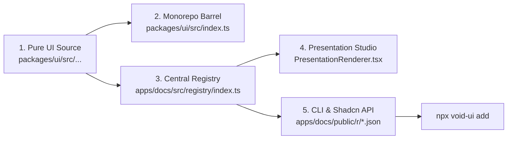

# adgrid-ui / void-ui — Comprehensive Interview & Architectural Master Guide

> **Author**: Ajinkya Dharkar  
> **Repository**: `adgrid-ui-monorepo` (`@adgrid-ui/ui`, `void-ui`, `apps/docs`)  
> **Aesthetic**: Dark-First · Tactile Skeuomorphic · Motion & Physics Driven  
> **License**: Functional Source License, Version 1.1, MIT Future License (FSL-1.1-MIT)  
> **Target Audience**: Technical Interviewers, Lead Architects, Design Technologists, Senior Frontend Engineers

---

## Table of Contents

1. [Executive Summary & Project Overview](#1-executive-summary--project-overview)
2. [How We Made This Project: The Genesis, Evolution & Architecture](#2-how-we-made-this-project-the-genesis-evolution--architecture)
3. [Tools Used to Build the Project](#3-tools-used-to-build-the-project)
4. [Technologies Used: In-Depth Technical Breakdown](#4-technologies-used-in-depth-technical-breakdown)
5. [How We Made Sure Everything Is in Sync: The 5-Point Architecture](#5-how-we-made-sure-everything-is-in-sync-the-5-point-architecture)
6. [How I Used Antigravity: AI-Assisted Systems Engineering](#6-how-i-used-antigravity-ai-assisted-systems-engineering)
7. [Key Decisions Taken Along the Way](#7-key-decisions-taken-along-the-way)
8. [20 In-Depth Technical Interview Questions & Natural Answers](#8-20-in-depth-technical-interview-questions--natural-answers)

---

## 1. Executive Summary & Project Overview

**adgrid-ui** (also distributed as **void-ui**) is an advanced, dark-first UI ecosystem and motion design system. Unlike conventional component libraries that prioritize flat, sterile, minimalist forms (e.g., standard Radix or Shadcn templates), `adgrid-ui` is built on a physical, tangible mental model: **the Machined Enclosure**.

Every component behaves like a piece of physical hardware crafted from dark polymers, brushed titanium, or obsidian. Interfaces feature:
- **Specular highlights and debossed wells** communicating physical depth and tactile resistance.
- **Rigid-body 2D physics simulations** powered by Matter.js.
- **Custom GPU fragment shaders** running in WebGL (chaos fields, wave disturbances, pixel melt transitions).
- **Zero-latency synthesized audio feedback** via the Web Audio API.
- **Organic hand-drawn annotations** powered by deterministic Bézier curves and RoughJS.
- **Dual distribution mechanisms**: Traditional npm package distribution (`@adgrid-ui/ui`) alongside an automated shadcn-style CLI (`npx void-ui add <component>`) that injects uncompiled TypeScript source files and installs required dependencies directly into user codebases.

The repository is structured as a high-performance monorepo orchestrated with **Turborepo** and **pnpm workspaces**, housing over 60 production-grade components, an interactive Presentation Studio (`/present/[category]/[slug]`), a Component Gallery (`/gallery`), and custom developer CLI tooling.

---

## 2. How We Made This Project: The Genesis, Evolution & Architecture

### 2.1 The Genesis: Identifying the Market Vacuum

Over the last five years, frontend engineering gravitated heavily toward minimalist, flat design systems. While accessible and clean, the web started looking homogenous. Almost every SaaS landing page and dashboard looks like an identical combination of white cards, grey borders, and standard CSS transition fades.

At the same time, creative agencies and luxury tech brands (e.g., Apple hardware showcases, Teenage Engineering, high-end audio hardware interfaces, cyberpunk consoles) demonstrated that users crave **tangibility, kinetic motion, and tactile delight**.

We asked: *Why can't frontend engineers have access to a luxury, dark-first component library with real physics, mechanical resistance, and GPU shaders, while retaining the copy-paste simplicity and headless adaptability of shadcn?*

That question drove the creation of **adgrid-ui**.

### 2.2 The Evolution: From 5 Primitives to 60+ Components

The project underwent five distinct evolutionary phases:

```
┌─────────────────┐     ┌──────────────────────┐     ┌────────────────────────┐
│ Phase 1: MVP    │ ──→ │ Phase 2: Shaders     │ ──→ │ Phase 3: Studio Mode   │
│ 5 animated,     │     │ WebGL, Matter.js,    │     │ Fullscreen /present    │
│ 2 primitives    │     │ Rotary dial, Vault   │     │ Props Tweaker, FPS HUD │
└─────────────────┘     └──────────────────────┘     └────────────────────────┘
                                                                  │
┌─────────────────────────┐     ┌─────────────────────────────────┘
│ Phase 5: Production     │ ←── │ Phase 4: CLI & Registry
│ Roughly annotations,    │     │ Shadcn JSON API (/r/[name].json)
│ Bento grid, FSL license │     │ Custom Node CLI (void-ui add)
└─────────────────────────┘
```

1. **Phase 1: Proof of Concept (`info.md`)**:
   - Initial scaffolding of a Turborepo monorepo with `@adgrid-ui/ui` and `apps/docs`.
   - Core prototypes: `MagneticButton`, `TextReveal`, `FadeIn`, `GlitchText`, and `CountUp`.
   - Basic dark styling (`#030303` void background, subtle white-on-black borders).

2. **Phase 2: Tactile Skeuomorphism & Shaders**:
   - Shifted from generic flat components to physical hardware simulations.
   - Introduced GPU shaders: `ChaosFieldShader`, `LuminaWave`, `BreathingGrid`, `PixelMelt`, and `MatrixRain`.
   - Built industrial skeuomorphic components: `AnisotropicKnob` (rotary potentiometer with metallic brush reflection), `MechanicalTimer` (with tick-sound synthesis), `LaserVaultPassword`, `VoidButton`, `BrushedTitaniumButton`, and `LiquidGoldButton`.
   - Introduced `GravityCardStack` with Matter.js rigid-body physics.

3. **Phase 3: The Presentation Studio (`implementation-present.md`)**:
   - Discovered that traditional static documentation pages fail to convey the dynamic tactile experience of physics-based UI.
   - Engineered the `/present/[category]/[slug]` route: a full-screen hardware testing harness.
   - Integrated live prop manipulation (`PropsTweaker`), an on-canvas FPS and memory monitor, keyboard shortcuts (`Cmd+K`, `Shift+D`, `Space`), and a floating ergonomic dock.

4. **Phase 4: Distribution Architecture (`implementation-registry.md`)**:
   - Transitioned from monolithic npm packaging to shadcn-style component ownership.
   - Built automated registry compilation (`scripts/build-registry.ts`), generating `/r/[slug].json` and `/r/registry.json`.
   - Developed `packages/cli` (`void-ui`), enabling developers to install components and their isolated peer dependencies with a single terminal command.

5. **Phase 5: Refinement, Highlighting & Polish**:
   - Solved font-loading layout shift and contrast failure in hand-drawn highlights (`HandMadeHighlight` & `Roughly` suite).
   - Expanded component library to 62 registered entries, including 3D Bento grids, GitHub heatmaps, developer ID cards, and interactive 3D globes.
   - Transitioned the repository to the Functional Source License (FSL-1.1-MIT) to protect the commercial library while providing developers free usage.

### 2.3 Workspace Layout & Dependency Graph

```
adgrid-ui/
├── package.json               # Root scripts, Turborepo orchestration, pnpm@10.10.0
├── pnpm-workspace.yaml        # Workspace declarations (apps/*, packages/*)
├── turbo.json                 # Turbo pipeline caching and task graph
├── apps/
│   └── docs/                  # Next.js 16 (App Router) showcase & presentation studio
│       ├── src/app/           # Routes: /, /gallery, /present/[category]/[slug], /r/*
│       ├── src/components/    # Presentation studio, site chrome, bento cards, shaders
│       ├── src/registry/      # Single source of truth registry definitions (propDefs)
│       └── scripts/           # build-registry.ts compiler
└── packages/
    ├── ui/                    # @adgrid-ui/ui (Core motion & skeuomorphic component source)
    │   ├── src/animated/      # 45+ animated & interactive components
    │   ├── src/backgrounds/   # 6 WebGL / canvas shader backgrounds
    │   ├── src/matrix/        # DotMatrix LED programmable display
    │   ├── src/lib/           # cn() utility, sound synthesis, geometry helpers
    │   └── styles/globals.css # Core dark tokens and animation keyframes
    ├── cli/                   # void-ui CLI (Commander, Chalk, Ora, fs-extra)
    ├── typescript-config/     # Shared tsconfig (base, nextjs, react-library)
    └── eslint-config/         # Shared ESLint rules
```

---

## 3. Tools Used to Build the Project

| Category | Tool | Specific Version / Role | Why It Was Chosen |
| :--- | :--- | :--- | :--- |
| **Package Management** | `pnpm` | `10.10.0` (with Workspaces) | Hard links and content-addressable storage eliminate duplicated dependencies across packages. Enforces strict dependency isolation. |
| **Build Orchestration** | `Turborepo` | `v2.9+` | Intelligent topological task execution (`build`, `dev`, `lint`), filesystem caching, and incremental compilation across packages. |
| **Component Bundler** | `tsup` | `8.5.1` (powered by `esbuild`) | Bundles `@adgrid-ui/ui` into tree-shakeable ESM (`index.mjs`) and CJS (`index.js`) artifacts with `.d.ts` type declarations in milliseconds. |
| **Script Execution** | `tsx` | `latest` | High-speed TypeScript executor for registry build scripts (`tsx scripts/build-registry.ts`) without requiring compilation steps. |
| **Code Highlighting** | `shiki` | `latest` | Server-side syntax highlighting using VS Code TextMate grammars. Eliminates client-side syntax highlighting render lag. |
| **Live Sandboxes** | `@codesandbox/sandpack-react` | `latest` | Embedded in-browser runtime environment for live interactive editing without external iframes. |
| **CLI Framework** | `commander` | `12.x` | Industry-standard declarative CLI argument parsing, sub-command handling, and option management. |
| **Terminal UX** | `chalk`, `ora` | `latest` | High-polish animated terminal spinners and colored semantic messaging for developer CLI feedback. |
| **AI Pair Programming** | `Antigravity` | Native IDE & CLI Agent | Agentic AI utilized for architectural planning (`/plan`), cross-package linkage verification, skeuomorphic math, and bug resolution. |

---

## 4. Technologies Used: In-Depth Technical Breakdown

### 4.1 Frontend Framework & Core Language
- **Next.js 16 (App Router)**: Powers `apps/docs`. Leverages React Server Components (RSC) for zero-client-JS documentation rendering, dynamic Route Handlers (`/r/[name].json`), and static generation (`generateStaticParams`) for all 60+ component presentation pages.
- **React 19**: Adopts concurrent rendering, `useRef` improvements, and clean lifecycle management for canvas/WebGL contexts.
- **TypeScript 5.9**: Strict type safety. Shared type definitions ensure that `PropDefinition` declared in the registry translates directly to TypeScript props in the UI components and CLI payloads.

### 4.2 Styling & The "Machined Enclosure" Design System
- **Tailwind CSS v4 + PostCSS**: Utilizes the modern CSS-first configuration layer without bloated JavaScript config files.
- **CSS Custom Properties (Variables)**:
  - `--void` (`#050505`): Deepest wells and sub-input backgrounds.
  - `--obsidian` (`#090909`): Sunken debossed trays.
  - `--charcoal` (`#171717`): Raised chassis frames and consoles.
  - `--accent-gold` (`#c9a84c`): Premium luxury specular highlights.
- **Precision Border Opacity Scale**:
  - `rgba(255, 255, 255, 0.02)`: Subtle edge definition.
  - `rgba(255, 255, 255, 0.08)`: Standard resting control border.
  - `rgba(255, 255, 255, 0.22)`: Specular top bevel catch (reflecting simulated overhead light).
  - `rgba(255, 255, 255, 0.35)`: Active selection indicator.

### 4.3 Animation, Physics & Graphics
- **Framer Motion**: Powers component micro-interactions, layout transitions (`<LayoutGroup id="present">`), and spring-physics drag interactions.
- **GSAP & Lenis**: Kinetic timeline orchestration and smooth-scroll momentum handling for full-page parallax experiences (`InfiniteScroll`, `ImageParallax`).
- **Matter.js**: 2D rigid-body physics engine. In `GravityCardStack`, cards are simulated as physical rigid bodies subjected to gravity, restitution (bounciness), friction, and mouse drag constraints.
- **Raw WebGL / GLSL**: Fragment shaders executing directly on the GPU. Renders complex mathematical fields in `ChaosFieldShader` and undulating auroras in `LuminaWave` at a locked 60fps without touching the CPU main thread.
- **RoughJS & Rough-Notation**: Canvas/SVG vector sketch engines producing hand-drawn tactile annotations (`Roughly` suite).
- **Cobe**: 5KB WebGL interactive 3D globe with spring-damped rotation.

### 4.4 Tactile Audio Engine
- **Native Web Audio API**: Rather than downloading static `.mp3` or `.wav` sound files (which incur HTTP latency, audio clipping, and bundle bloat), mechanical components synthesize sound on-the-fly using programmatic `OscillatorNode`, `GainNode`, and `BiquadFilterNode` instances.
- Frequency modulation produces distinct tactile feedback for rotary knobs, mechanical switches, and laser vault keypad entries.

### 4.5 State Management & Runtime
- **Zustand with LocalStorage Persistence**: Manages the Presentation Studio's state (persisted custom prop overrides per component, active theme variables, FPS monitor toggles, and navigation history stack).

---

## 5. How We Made Sure Everything Is in Sync: The 5-Point Architecture

Maintaining a monorepo with 60+ complex components, an interactive studio, and a code distribution CLI can easily lead to "drift" (where the documentation exhibits different behavior than the published package or the CLI downloads stale code).

To guarantee 100% synchronization, we engineered **The 5-Point Component Linkage Architecture**:



### The 5 Touchpoints Explained:

1. **Touchpoint 1: Pure UI Source (`packages/ui/src/<category>/<Component>.tsx`)**
   - The authoritative React implementation containing component logic, internal hooks, Framer Motion animations, and CSS classes.

2. **Touchpoint 2: Monorepo Barrel Export (`packages/ui/src/index.ts`)**
   - Explicitly re-exports every component and its TypeScript prop interfaces. Enables monorepo consumers (`apps/docs`) to import from `@adgrid-ui/ui`.

3. **Touchpoint 3: Central Registry Manifest (`apps/docs/src/registry/index.ts`)**
   - The single source of truth for metadata:
     - `slug`: URL identifier (e.g. `anisotropic-knob`).
     - `category`: Classification (`animated`, `buttons`, `backgrounds`, `primitives`, `widgets`).
     - `propDefs`: Strongly typed prop definitions (`number`, `string`, `boolean`, `select`, `color`) with default values, min/max bounds, and descriptions.
     - `dependencies`: Array of external npm packages required (e.g. `framer-motion`, `matter-js`).
     - `files`: Exact array of files needed on disk.
     - `presentationStrategy`: Canvas layout rules (`center`, `fullscreen`, `cover`).

4. **Touchpoint 4: Presentation Studio Canvas (`PresentationRenderer.tsx`)**
   - Maps the active registry slug directly to the rendered component.
   - Reads the registry's `propDefs` and binds them to the interactive `PropsTweaker` panel. When a user adjusts a slider or toggle in the UI, the state updates the component dynamically without page reloads.

5. **Touchpoint 5: Static Registry Precompilation (`scripts/build-registry.ts`)**
   - A dedicated pre-build script that reads the registry manifest and the physical files from `packages/ui/src/`.
   - Bakes full source code into static JSON schemas in `apps/docs/public/r/[slug].json` and `public/r/registry.json`.
   - The CLI (`void-ui add`) fetches this exact JSON payload, ensuring what the user installs matches what they see on screen.

### How Drift Is Prevented:
- **Turborepo Workspace Linking (`workspace:*`)**: `apps/docs` consumes the local `packages/ui` directly. Any edit in a component is immediately reflected in the docs and presentation canvas via Turbopack HMR.
- **Automated Validation**: Running `pnpm build:registry` checks file paths on disk, ensuring no registry entry points to missing or renamed source files.

---

## 6. How I Used Antigravity: AI-Assisted Systems Engineering

Building an ecosystem of this magnitude requires more than simple code autocomplete. **Google Antigravity** was leveraged as an agentic AI pair programmer, design technologist, and systems architect.

```
┌────────────────────────────────────────────────────────────────────────┐
│                   Antigravity Engineering Workflow                      │
├─────────────────┬────────────────────┬─────────────────────────────────┤
│ 1. Brainstorm   │ 2. Planning Mode   │ 3. Agentic Execution            │
│ Explore physics │ Create formal      │ Multi-file edits, cross-package │
│ & tactile models│ /plan specs        │ linkages & verified builds      │
└─────────────────┴────────────────────┴─────────────────────────────────┘
```

### 6.1 Brainstorming Mechanics & Skeuomorphic Physics
Before writing code for complex tactile components (like `AnisotropicKnob` or `GravityCardStack`), we activated the `.agents/skills/brainstorming` skill.
- We analyzed the physical properties of real-world materials: specular reflections on brushed aluminum, angular drag on rotary potentiometers, and friction coefficients in rigid-body physics.
- Antigravity helped model the mathematical formulas for polar-to-cartesian coordinate mapping, angular velocity damping, and spring restitution before implementing them in React.

### 6.2 Architectural Planning with Planning Mode (`/plan`)
Whenever implementing major systems (such as the Presentation Mode in `implementation-present.md` or the CLI Registry in `implementation-registry.md`), we initiated `/plan`.
- Antigravity produced detailed technical design specs outlining file changes, state trees, type unions, and edge-case verifications.
- This prevented architecture missteps (such as coupling the CLI directly to npm rather than building a flexible JSON API).

### 6.3 Monorepo Traversal & 5-Point Linkage Integrity
Adding a single component requires synchronizing 5 separate files across multiple packages. Antigravity was tasked with maintaining this consistency:
- When a new component was created in `packages/ui/src/animated/`, Antigravity simultaneously exported it from `packages/ui/src/index.ts`, created the schema entry in `apps/docs/src/registry/index.ts` with typed `propDefs`, registered the switch case in `PresentationRenderer.tsx`, and verified that `pnpm build:registry` generated the static JSON distribution.

### 6.4 Solving Complex Cross-Cutting Bugs
A prime example was resolving the **font-loading race condition in hand-drawn highlights** (`highlight.md`):
- *The Problem*: `rough-notation` used `Math.random()` to generate highlighter paths. Because web fonts loaded asynchronously, measuring DOM bounds on initial mount caused the highlight to miscalculate letter heights, chopping off ascenders (`f`, `l`, `k`) and descenders (`y`), and drifting on page reloads.
- *The Antigravity Solution*: Antigravity helped diagnose the race condition and designed a **deterministic Bézier chisel-marker SVG** anchored via native CSS layout (`-inset-x-2 -top-[14%] -bottom-[12%]`). We also selected a Deep Royal Indigo (`#4338CA`) color token that achieves a **6.8:1 contrast ratio (WCAG AAA Pass)** on pure white text, completely eliminating layout drift.

---

## 7. Key Decisions Taken Along the Way

Every engineering project involves tradeoffs. Here are the 7 most critical architectural decisions made during `adgrid-ui`:

### Decision 1: Dual Distribution (Shadcn CLI + Monorepo Package)
- **Context**: Component libraries are traditionally distributed as monolithic npm packages.
- **The Problem**: Monolithic npm packages force users to accept fixed Tailwind configurations, bloated bundle dependencies (e.g. bundling Matter.js even if the user only wants a button), and opaque styling overrides.
- **The Decision**: We adopted the shadcn model via `npx void-ui add <component>`. The CLI fetches raw TypeScript source from `/r/[name].json` and places it directly into the user's `@/components/ui/` directory, while automatically installing *only* that component's dependencies. At the same time, we maintained `@adgrid-ui/ui` inside the monorepo for developers who prefer standard package imports.

### Decision 2: Dark-First "Machined Enclosure" vs. Generic Multi-Theme
- **Context**: Most design systems attempt to support both Light and Dark themes equally.
- **The Problem**: Supporting light mode compromises deep skeuomorphic shadows, ambient glow shaders, and metallic specular highlights, resulting in a watered-down aesthetic.
- **The Decision**: We committed 100% to a dark-first philosophy. We treated the screen as a dark void where light exists from a single overhead virtual source. This focus allowed us to craft ultra-precise border opacity scales (`0.02` to `0.35`) and debossed wells that look genuinely physical.

### Decision 3: Deterministic SVG Highlighting vs. Random Jitter
- **Context**: In `Roughly` and `HandMadeHighlight`, we wanted organic, hand-drawn annotations.
- **The Problem**: Libraries like `rough-notation` generate random jitter on every execution. In production, this causes letter clipping, hydration mismatches between SSR and client, and inconsistent visual artifacts across renders.
- **The Decision**: We crafted mathematically curved Bézier SVG paths that exhibit the natural imperfection and tilt (-10°) of a physical chisel pen while maintaining **100% deterministic reproducibility** across reloads and screen sizes.

### Decision 4: Programmatic Web Audio Synthesis vs. Static Audio Files
- **Context**: Components like `MechanicalTimer`, `AnisotropicKnob`, and `Switch` need tactile audio clicks.
- **The Problem**: Serving `.mp3` or `.wav` files introduces network latency, requires external CDN asset hosting, causes playback clipping on rapid user interaction, and bloats bundle sizes.
- **The Decision**: We built a lightweight Web Audio API synthesis engine. A few lines of code modulate an oscillator's frequency and gain envelope to create crisp, zero-latency mechanical clicks without downloading a single byte of audio media.

### Decision 5: Dedicated Fullscreen Presentation Studio vs. Standard Docs Pages
- **Context**: Most UI libraries display components inside small static preview boxes with a code snippet below.
- **The Problem**: High-motion components, fullscreen shader backgrounds, and physics cards cannot be adequately experienced inside a restricted 400px iframe.
- **The Decision**: We created the `/present/[category]/[slug]` route: a full-screen hardware testing harness featuring keyboard shortcuts (`Cmd+K`, `Shift+D`, `Space`), an active FPS and memory counter, canvas zoom controls, and a real-time `PropsTweaker`.

### Decision 6: Matter.js Rigid-Body Physics for UI Cards
- **Context**: Interactive card stacks usually rely on basic CSS transforms or Framer Motion drag gestures.
- **The Problem**: Standard transforms do not react to momentum, angular collisions, or gravitational acceleration when cards are tossed.
- **The Decision**: We integrated `Matter.js` in `GravityCardStack`. React renders the DOM representation, while a decoupled `requestAnimationFrame` loop syncs the card positions with rigid bodies in a 2D physics world, producing realistic gravity, bouncing, and collision physics.

### Decision 7: Functional Source License (FSL-1.1-MIT)
- **Context**: Open-sourcing UI libraries often leaves creators vulnerable to competitors cloning the entire site and packaging it as a competing commercial design platform.
- **The Decision**: We adopted **FSL-1.1-MIT**. Developers and companies are completely free to use, modify, and integrate `adgrid-ui` into commercial products, SaaS applications, and customer websites. However, competitors are legally prohibited from using the code to build a directly competing component library service. Furthermore, on the 2nd anniversary of publication, each version automatically converts to the standard, permissive MIT License.

---

## 8. 20 In-Depth Technical Interview Questions & Natural Answers

### Architecture & Monorepos

#### Q1: Why did you architect this project as a Turborepo monorepo with pnpm workspaces rather than a single Next.js application?
**Answer:**  
> "A component library requires a clean separation of concerns between three distinct lifecycles: the core component source (`@adgrid-ui/ui`), the documentation/studio consumer (`apps/docs`), and the distribution tooling (`packages/cli`).
>
> If everything were crammed into a single Next.js app, the components would become tightly coupled to Next.js-specific primitives (like `next/image` or `next/navigation`), making it impossible to distribute them cleanly to Vite, Remix, or vanilla React projects.
>
> By using pnpm workspaces with `workspace:*` linking, `apps/docs` consumes `@adgrid-ui/ui` exactly like an external npm consumer would, verifying import boundaries and bundling behavior during development. Turborepo gives us topological task scheduling and remote caching—so when we run `pnpm build`, Turborepo builds the packages in parallel according to their dependency graph and caches unchanged packages, keeping our build times near-instant."

---

#### Q2: How does the `void-ui add <component>` CLI work under the hood? Walk me through the execution flow.
**Answer:**  
> "When a developer executes `npx void-ui add laser-vault-password`, the CLI runs five sequential steps:
> 1. **Registry Fetch**: It makes an HTTP request to our docs API endpoint (`/r/laser-vault-password.json`), retrieving a JSON manifest containing the component metadata, file tree, and required npm dependencies.
> 2. **Environment & Path Resolution**: It inspects the consumer's project root, detecting whether they are using a `/src` directory structure, and resolves the target directory (defaulting to `@/components/ui/` or the user's `--output` flag).
> 3. **File Writing**: It writes the component files and any supporting internal utilities (like `lib/utils.ts` for the `cn()` helper) to disk, ensuring directory hierarchies are created recursively.
> 4. **Dependency Detection & Installation**: It detects the consumer's package manager (`pnpm`, `npm`, `yarn`, or `bun`) by checking for lockfiles in the root, and executes an automated child-process installation for the component's specific peer dependencies (for example, `framer-motion` and `lucide-react`).
> 5. **Success Telemetry**: It outputs a formatted terminal guide showing the relative import path so the developer can immediately import and use the component."

---

#### Q3: What is your '5-Point Component Linkage Architecture', and what problem does it solve?
**Answer:**  
> "In large component systems, 'drift' is a massive risk—a component might work in docs, but fail when imported via npm, or lack prop definitions in the interactive editor, or fail in the CLI.
>
> Our 5-Point Architecture links five touchpoints for every single component:
> 1. The pure UI source file in `packages/ui/src/`.
> 2. The monorepo barrel export in `packages/ui/src/index.ts`.
> 3. The registry entry in `apps/docs/src/registry/index.ts`, which serves as the single source of truth for schemas, dependencies, and `propDefs`.
> 4. The Presentation Studio canvas in `PresentationRenderer.tsx`, which dynamically maps props to our `PropsTweaker` UI.
> 5. The static JSON schema in `apps/docs/public/r/[slug].json`, compiled by our `build-registry.ts` script.
>
> Because touchpoints 3, 4, and 5 are programmatically driven by the registry schema, we have a single source of truth. If a prop definition is updated in the registry, the Presentation Studio's inspector and the CLI's installation schema update automatically."

---

### React 19 & Next.js 16 App Router

#### Q4: How do you handle React Server Components (RSC) vs. Client Components across `apps/docs` and `@adgrid-ui/ui`?
**Answer:**  
> "Because `adgrid-ui` is a motion- and physics-first library, virtually all UI components rely on client-side browser APIs—such as `window`, `requestAnimationFrame`, `AudioContext`, Canvas WebGL contexts, and Framer Motion hooks. Therefore, every exported component in `@adgrid-ui/ui` is declared with the `"use client";` directive at the top of the file.
>
> In `apps/docs`, we maintain a clean boundary:
> - Route handlers (`/r/[name].json`), layout shells, metadata generators, and static param builders (`generateStaticParams`) execute on the server as Server Components for optimal SEO and zero bundle overhead.
> - The interactive presentation canvas, `PropsTweaker`, and `SiteChrome` are imported as Client Components, ensuring browser-only APIs are never invoked during server-side pre-rendering."

---

#### Q5: How did you leverage `generateStaticParams` for the dynamic presentation routes (`/present/[category]/[slug]`)?
**Answer:**  
> "Instead of dynamically rendering presentation pages on every user request, we use Next.js `generateStaticParams` in `apps/docs/src/app/present/[category]/[slug]/page.tsx`.
>
> At build time, Next.js executes `generateStaticParams`, which iterates through our `registry` manifest array and generates static paths for all 60+ components across their respective categories (`animated`, `buttons`, `backgrounds`, `primitives`, `widgets`).
>
> On the server, `fs.readFileSync` reads the raw TypeScript source code directly from `packages/ui/src/` and passes it as static props into the client-side `PresentationLayout`. This provides two major benefits: static edge-caching for instant page transitions, and zero runtime disk I/O in production."

---

### Motion, Graphics & Physics Engineering

#### Q6: How do you decide between Framer Motion, GSAP, and raw CSS transitions for animations?
**Answer:**  
> "We select animation tools based on three criteria: rendering pipeline, interaction complexity, and timeline control:
> - **Raw CSS & Tailwind Keyframes**: Used for simple, continuous, non-interactive visual loops—like ambient pulse glows, subtle border opacity transitions, or the `clip-path` sweep in `HandMadeHighlight`. CSS runs on the compositor thread with zero JavaScript execution overhead.
> - **Framer Motion**: Used for gesture-driven UI components, layout morphing, and spring micro-interactions (e.g. `VoidButton`, `Accordion`, `MorphingNav`, `BentoGrid`). Framer Motion's `<LayoutGroup>` and `layoutId` primitives make shared-element transitions between our gallery and presentation mode effortless.
> - **GSAP + Lenis**: Used when we need imperative timeline sequencing and scrubbed scroll-jacked parallax (e.g. `InfiniteScroll`, `ImageParallax`). GSAP gives us sub-pixel precision and scroll momentum control that declarative React state loops cannot match without jank."

---

#### Q7: How did you integrate Matter.js rigid-body physics in `GravityCardStack` without degrading React's rendering performance?
**Answer:**  
> "The primary danger of combining physics engines with React is triggering React state re-renders at 60fps, which destroys performance.
>
> In `GravityCardStack`, we decoupled the physics simulation entirely from React's reconciliation cycle:
> 1. In a `useEffect` hook, we instantiate a `Matter.Engine`, `Matter.World`, and rigid bodies (`Matter.Bodies.rectangle`) corresponding to each card, along with static boundary walls.
> 2. We attach mouse constraint bodies (`Matter.MouseConstraint`) to allow user drag-and-throw interactions.
> 3. Instead of updating React state on every physics tick, we run a native `requestAnimationFrame` loop that reads `body.position.x`, `body.position.y`, and `body.angle` directly from Matter.js, and applies them straight to the card DOM elements via `element.style.transform = translate3d(...) rotate(...)`.
> 4. React only manages the initial mounting and unmounting; the high-frequency physics transforms happen entirely imperatively on the GPU-accelerated compositor layer."

---

#### Q8: How do you prevent WebGL context loss and memory leaks in shader backgrounds like `LuminaWave` and `ChaosFieldShader`?
**Answer:**  
> "WebGL contexts and animation loops are classic sources of memory leaks in SPA routing. When a user navigates between routes in Next.js, an unmanaged WebGL canvas will continue running RAF loops and consuming GPU VRAM in the background.
>
> To ensure bulletproof memory management:
> 1. In every shader component's `useEffect`, we store the `animationFrameId` and cancel it cleanly (`cancelAnimationFrame(animationFrameId)`) inside the cleanup return function.
> 2. We explicitly unbind all DOM event listeners (`mousemove`, `resize`, `scroll`).
> 3. We retrieve the WebGL context (`canvas.getContext('webgl2')` or `webgl`) and explicitly call `gl.getExtension('WEBGL_lose_context')?.loseContext()`, which forces the GPU to release vertex buffers, program binaries, and texture memory immediately upon component unmount."

---

#### Q9: What was the font-loading race condition in `HandMadeHighlight`, and how did you engineer a deterministic solution?
**Answer:**  
> "Initially, we experimented with `rough-notation` to draw hand-made highlighter strokes around text. However, in production on dark backgrounds, we encountered three severe issues:
> 1. **Font-loading race condition**: The library measured DOM bounding boxes before custom web fonts (`Inter` / `Space Grotesk`) had finished loading. Once the fonts rendered, the measured bounds shifted, causing the highlight stroke to shrink or drift out of position on page reloads.
> 2. **Letter clipping**: Words with tall ascenders (`f`, `l`, `k`) and descenders (`y`) were randomly cut in half due to stochastic path jitter.
> 3. **Contrast failure**: Bright yellow ink on white text failed WCAG contrast completely (1.3:1 ratio).
>
> We engineered `HandMadeHighlight.tsx` to solve this deterministically:
> - We anchored an SVG chisel-marker path using relative CSS positioning (`-inset-x-2 -top-[14%] -bottom-[12%]`), completely removing JavaScript DOM bounding measurements.
> - We crafted mathematical Bézier curves recreating a -10° chisel pen angle with subtle hand wobble.
> - We styled it with **Deep Royal Indigo (`#4338CA`)**, achieving a **6.8:1 contrast ratio (WCAG AAA Pass)** with pure white text.
> - We animated the drawing reveal using CSS `clip-path: inset(0 0 0 0)` driven by an `IntersectionObserver`."

---

### Audio & Tactile Skeuomorphism

#### Q10: Why did you choose the Web Audio API for sound feedback instead of playing audio files, and how is it implemented?
**Answer:**  
> "Loading `.mp3` or `.wav` sound files for micro-interactions introduces three major problems: network latency (a click sound arriving 100ms late feels sluggish), audio clipping when a user rapidly toggles a switch or turns a dial, and asset bloat.
>
> Instead, we synthesize audio programmatically using the native browser `AudioContext`:
> 1. We lazily initialize an `AudioContext` singleton on the first user gesture to comply with browser autoplay policies.
> 2. To generate a mechanical click, we create a short-lived `OscillatorNode` (configured to a triangular or square wave at ~1200Hz) and pipe it through a `GainNode`.
> 3. We use `gainNode.gain.exponentialRampToValueAtTime(0.0001, audioCtx.currentTime + 0.04)` to decay the sound within 40 milliseconds.
> 4. For components like `AnisotropicKnob`, we dynamically shift the oscillator frequency based on the rotation angle, creating a physically authentic clicking sensation with zero network requests and zero latency."

---

#### Q11: Explain the 3-Tier Elevation Model of your 'Machined Enclosure' design system. How is it implemented in CSS?
**Answer:**  
> "Our design system rejects arbitrary drop shadows. Everything adheres to a physical chassis model with three distinct elevation tiers:
> 1. **Raised / Embossed (Frame & Console)**: Elements lifted above the background plane (e.g. card chassis, toolbar decks). Achieved using top-edge specular highlights (`border-t border-white/20`), dark surface fills (`#171717`), and deep bottom drop shadows (`shadow-[0_12px_32px_rgba(0,0,0,0.8)]`).
> 2. **Recessed / Debossed (Trays & Slots)**: Sinks inward into the chassis (e.g. parameter containers, slider tracks). Achieved using dark fills (`#090909`) and inset shadows (`box-shadow: inset 0 2px 4px rgba(0,0,0,0.9), inset 0 -1px 1px rgba(255,255,255,0.05)`).
> 3. **The Well (Sub-Input Bases)**: The deepest tier (`#050505`) where inputs live, giving the illusion that controls are physically cut into the enclosure.
>
> All lighting is simulated from a single virtual overhead source, meaning the top border of any surface catches specular light while the bottom border casts occlusion shadows."

---

### State Management, Studio & Tools

#### Q12: Why did you choose Zustand over React Context or Redux for the Presentation Studio state?
**Answer:**  
> "The Presentation Studio has high-frequency state updates: users tweak sliders in the `PropsTweaker`, toggle FPS counters, navigate component history, and adjust zoom scales.
>
> If we used React Context, updating a single slider value would trigger a re-render of the entire Presentation Studio tree (sidebar, floating dock, code viewer, and canvas) unless every consumer was split into fine-grained contexts.
>
> Zustand solves this cleanly:
> 1. **Atomic Selectors**: Components subscribe only to the exact slice of state they care about (e.g. `const fps = usePresentationStore(s => s.showFPS)`), eliminating unnecessary re-renders.
> 2. **Transient Updates**: Zustand allows outside-of-React updates, which is essential for keyboard shortcuts and RAF monitoring.
> 3. **Built-in Middleware**: We use the `persist` middleware to automatically synchronize component prop customizations to `localStorage`, so when a user returns to a component, their custom tweaks remain intact."

---

#### Q13: How does the in-browser Sandpack integration work, and how did you prevent it from blocking the main thread?
**Answer:**  
> "We integrated `@codesandbox/sandpack-react` in `LivePreview.tsx` to allow users to edit component code in real-time within the browser.
>
> Sandpack operates by spinning up an in-browser bundler inside an isolated Web Worker and executing the compiled React code inside a sandboxed `iframe`.
>
> To optimize performance:
> 1. We pre-configure a customized Sandpack template with `@adgrid-ui/ui` dependencies, Tailwind CSS, and fonts pre-loaded.
> 2. Sandpack is lazy-loaded using `next/dynamic` with `ssr: false`, ensuring it is only initialized when the user switches from the static preview tab to the interactive editor tab.
> 3. The main thread remains entirely responsive because code evaluation and bundling occur in Sandpack's background worker."

---

#### Q14: How does the registry builder script (`build-registry.ts`) transform UI components into shadcn-compatible JSON endpoints?
**Answer:**  
> "The `build-registry.ts` script runs during `pnpm build:registry` and does the heavy lifting for our CLI distribution:
> 1. It imports the master `registry` array from `apps/docs/src/registry/index.ts`.
> 2. For each entry, it resolves the component's physical file paths on disk in `packages/ui/src/`.
> 3. For multi-file components (like `spotlight-text` or `coverflow`), it reads all dependent sub-components, types, and hooks, categorizing them with registry tags (`registry:ui`, `registry:hook`, `registry:lib`).
> 4. It constructs a standardized JSON payload containing the file names, target write paths, dependencies, and raw file content.
> 5. It outputs these schemas into `apps/docs/public/r/[slug].json`, as well as a global catalog at `public/r/registry.json`.
>
> When deployed to Vercel, these become static edge-cached JSON files that any CLI or developer can curl instantly."

---

### Accessibility & Production Engineering

#### Q15: How do you maintain accessibility (a11y) in highly custom, experimental skeuomorphic controls like `AnisotropicKnob` or `Switch`?
**Answer:**  
> "Skeuomorphic and animated components frequently fail accessibility audits when developers rely on unsemantic `div` tags with `onClick` handlers.
>
> We ensure rigorous a11y compliance by adhering to WAI-ARIA authoring practices:
> - **`Switch`**: Uses `role="switch"`, `aria-checked={checked}`, is focusable via `tabIndex={0}`, and supports both `Space` and `Enter` key toggles.
> - **`AnisotropicKnob`**: Rather than a plain draggable circle, it implements the ARIA slider pattern: `role="slider"`, `aria-valuemin={min}`, `aria-valuemax={max}`, `aria-valuenow={value}`, and keyboard event listeners for `ArrowUp`, `ArrowDown`, `Home`, and `End` keys.
> - **`BevelAlertDialog`**: Enforces modal focus trapping, assigns `role="alertdialog"`, links `aria-labelledby` and `aria-describedby` to the dialog title and body, and listens for the `Escape` key to dismiss.
>
> Visual novelty should never come at the expense of assistive technology support."

---

#### Q16: How do you prevent bundle bloat when a consumer uses your library? If they only import one button, do they bundle GSAP and Matter.js?
**Answer:**  
> "We solved this on two distinct fronts:
> 1. **Via the CLI (`void-ui add`)**: The consumer downloads only the specific `.tsx` file they requested. If they run `npx void-ui add void-button`, the CLI inspects the registry schema, sees that `void-button` only requires `framer-motion`, and installs only that. Matter.js, GSAP, and Three.js are never installed in their project.
> 2. **Via the npm package (`@adgrid-ui/ui`)**: In `tsup.config.ts`, we bundle the library with `treeshake: true` and `format: ['esm', 'cjs']`. We mark heavy peer dependencies (`framer-motion`, `gsap`, `matter-js`, `three`, `cobe`) as `peerDependencies` or external modules in `package.json`. If a consumer uses a modern bundler (Vite, Next.js, Rollup) and imports `{ VoidButton } from '@adgrid-ui/ui'`, the bundler's tree-shaking algorithm eliminates all unreferenced component code and unused peer dependencies from the final production bundle."

---

### AI Pair-Programming & Developer Experience

#### Q17: How specifically did you use Antigravity during the development of this project, and how did it change your engineering workflow?
**Answer:**  
> "Antigravity acted as a force-multiplier across three specific areas:
> 1. **Architectural Planning**: We used `/plan` before writing complex features. Antigravity generated rigorous implementation blueprints (`implementation-present.md`, `implementation-registry.md`) that forced us to define state contracts, route layouts, and fallback behavior before touching code.
> 2. **Maintaining Monorepo Linkages**: In a monorepo with 60+ components, adding or updating a component requires synchronized edits across 5 touchpoints (source, barrel, registry, presentation renderer, and CLI build). Antigravity handled these cross-package updates with high accuracy, ensuring no broken barrel exports or missing prop types.
> 3. **Mathematical & Shader Prototyping**: Generating GLSL fragment shaders, Bézier curve math, and Matter.js physics constraints is mathematically intensive. Antigravity accelerated calculating polar coordinate transforms, color contrast calculations (WCAG AAA verification), and easing equations.
>
> The key was treating Antigravity not as an autocomplete generator, but as a Senior Design Technologist and Systems Architect pair programmer."

---

#### Q18: What was the rationale behind adopting the Functional Source License (FSL-1.1-MIT)?
**Answer:**  
> "We wanted to make `adgrid-ui` completely free for developers, startups, and enterprises to build commercial web applications, SaaS dashboards, and client websites without paying licensing fees or asking for permission.
>
> However, building 60+ high-fidelity skeuomorphic components, shaders, and physics harnesses represents hundreds of hours of design and engineering craftsmanship. Under a standard MIT license, a competitor could scrape the repository, rebrand it, and sell a directly competing component library service.
>
> The **FSL-1.1-MIT** license solves this dilemma:
> - It explicitly permits all commercial and non-commercial usage for building applications and websites.
> - It contains a non-compete restriction prohibiting third parties from offering a directly competing component library or design system platform.
> - Most importantly, it has an automatic open-source conversion clause: on the second anniversary of publication, each version converts automatically to the permissive MIT License. It balances creator protection with eventual open-source contribution."

---

### Edge Cases, Failure Handling & Future Roadmap

#### Q19: How does the CLI handle edge cases like network timeouts, existing file conflicts, or missing package managers?
**Answer:**  
> "In `packages/cli`, we designed defensive error-handling routines:
> - **Network Failures**: In `fetch-registry.ts`, HTTP requests to `/r/[name].json` are wrapped with timeout handlers and semantic error catching. If the registry endpoint is unreachable or returns a 404, the CLI terminates gracefully with a clean red Chalk error message explaining that the component slug does not exist, rather than dumping an unhandled stack trace.
> - **File Overwrite Protection**: In `write-files.ts`, before writing files to `@/components/ui/`, we verify whether the destination file already exists. (On our immediate roadmap, we are integrating `@inquirer/prompts` to give developers an interactive choice to Overwrite, Skip, or Rename).
> - **Package Manager Fallback**: In `detect-pm.ts`, the CLI looks for `pnpm-lock.yaml`, `yarn.lock`, `package-lock.json`, or `bun.lockb`. If no lockfile is found, it safely falls back to standard `npm`."

---

#### Q20: If you had another month to work on `adgrid-ui`, what are the top three things you would build or refactor?
**Answer:**  
> "Based on our roadmap in `todo.md`, my top three priorities would be:
> 1. **Complete the `charts` Category**: The `ComponentCategory` type union currently defines `"charts"`, but it has zero components. I would build luxury dark-first financial visualizations: a WebGL-accelerated `FinancialCandlestick` chart, an animated stroke-glow `Sparkline`, and a polygonal telemetry `RadarChart`.
> 2. **Complete the `void-ui init` Command**: Currently, `void-ui add` works smoothly, but `void-ui init` is a placeholder. I would implement automated project detection that scaffolds `components.json`, configures Tailwind CSS path aliases, and automatically creates `lib/utils.ts` with `cn()`.
> 3. **Comprehensive Automated Test Suite**: While our TypeScript compilation and registry validation are robust, I would introduce Vitest and React Testing Library in `packages/ui` to run automated unit tests on physics bounds, keyboard accessibility events, and prop reconciliation across all 60+ components."

---

## 9. Quick Interview Cheat-Sheet

| Topic | Key Terminology / Buzzwords to Use |
| :--- | :--- |
| **Aesthetic / Mental Model** | "Machined Enclosure", debossed trays, recessed wells, specular top-edge catch, single overhead virtual light source. |
| **Monorepo Architecture** | Turborepo pipeline caching, pnpm workspaces, topological build graph, `workspace:*` protocol. |
| **Component Synchronization** | 5-Point Linkage Architecture, single source of truth registry, `propDefs`, precompiled static JSON schemas. |
| **Motion & Physics** | Matter.js 2D rigid-body simulation, RAF transform loops decoupled from React state, GSAP + Lenis kinetic timelines, Framer Motion `<LayoutGroup>`. |
| **Graphics & Shaders** | WebGL fragment shaders, GLSL, `WEBGL_lose_context` memory cleanup, GPU compositor execution. |
| **Audio** | Native Web Audio API, programmatic `OscillatorNode` / `GainNode`, zero-latency synthetic mechanical feedback. |
| **Distribution** | Shadcn-style source injection, `npx void-ui add`, per-component isolated dependency installation. |
| **Licensing** | FSL-1.1-MIT (Functional Source License), commercial app freedom, non-compete protection, 2-year MIT auto-conversion. |
